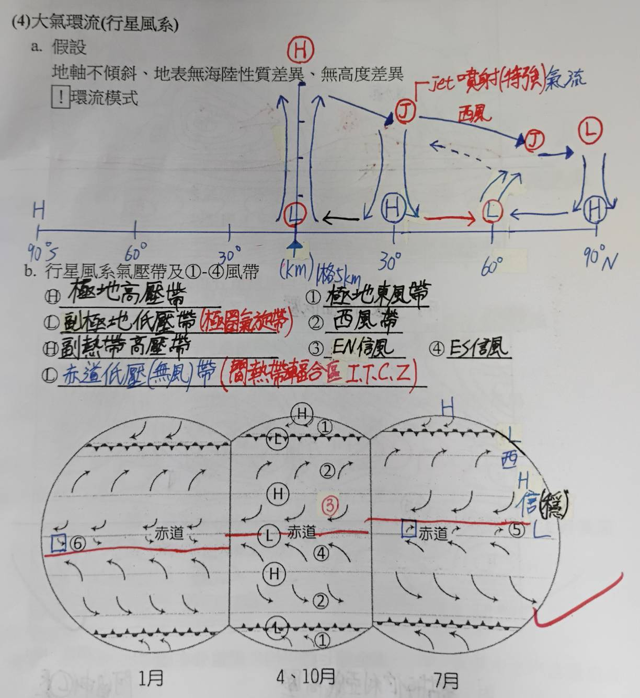
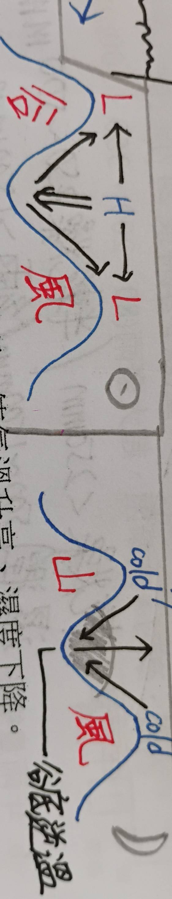
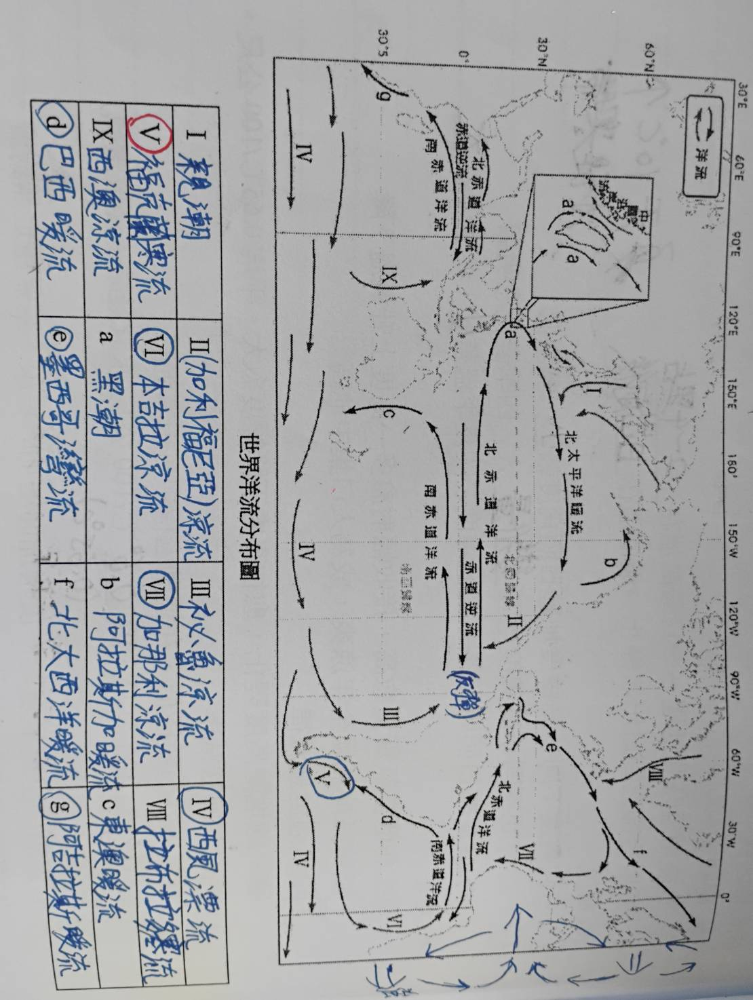
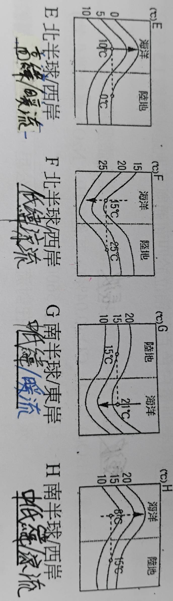

# L5 氣候系統

## 行星風系
- 詳見國中社會筆記
- 

### 大氣
- 主要熱源是**太陽**來的**短波輻射**(白天)
- 散熱則是由**地表**放出**長波輻射**(晚上)
- **溫室氣體**會吸收**長波輻射**
- (空氣質量 && 水氣)集中在地表附近(對流層)

## 影響氣溫的因素
- #### 時間
  - 正常情況下每日**最高溫**出現在**3點左右**
  - 輻射冷卻到日出$\rightarrow$**最低溫**出現在**日出前後**
- #### 緯度
  - **高緯度**地區**溫差大**、四季分明
  - 高低緯度間: **夏季**溫差**小**;**冬季**溫差**大**
- ### 地形
  - #### 高度與氣溫的關係
    - **濕**空氣: 高度每差100公尺，氣溫相差**0.6°C**(0.65°C)
    - **乾**空氣: 高度每差100公尺，氣溫相差**1°C**
  - #### 逆溫
    - **高度增加氣溫**也跟著**增加**的狀況
    - 
  - 熱帶高地涼爽 $\rightarrow$ 人口集中
- 另外還有(洋流 && 海陸性質)影響

### 洋流
- #### 洋流方向概述
  - **北半球順時針**;**南半球逆時針**(同科氏力方向)
  - **赤道**會有**逆流**(向東);南北赤道洋流向**西**
  - **西風帶**向西(**北半球無**，因為被大陸擋住了)
- #### 示意圖
  - 
  - 

## 天氣系統
- #### 旋轉方向
    | | 北半球 | 南半球 |
    | :--: | :--: | :--: |
    | 低壓 | 逆時針 | 順時針 |
    | 高壓 | 順時針 | 逆時針 |
- ### 低壓中心(氣旋)
  - 輻合
    | 類型 | 熱帶氣旋 | 溫帶氣旋 |
    | :--: | :--: | :--: |
    | 發生地點 | 熱帶海洋(緯度 > 5°) | 中緯度 |
    | 盛行季節 | 夏末秋初 | 冬季(夏季幾乎消失) |
    | 成因 | 對流$\rightarrow$高空水氣凝結 $\rightarrow$變暖$\rightarrow$循環 | 冷暖氣團交會 中心溫度低
    | 中心氣壓 | 較低(950-1000) | 較高(970-1010) |
    | 大小 | 較小(200-500)km | 較大1000km |
    | 高度 | (15~18)km | (5-6)km |
    | 移動 | 先慢後快 向西北 | 先快後慢 向東南 |
  - 溫帶氣旋生命週期約**2-6天**，(風速 >= 中颱)
- ### 高壓中心(反氣旋)
  - 輻散
    | 類型 | 暖高壓(動力高壓) | 冷高壓 |
    | :--: | :--: | :--: |
    | 發生地點 | 副熱帶(大洋) | 極區大陸 |
    | 強度 | 海: 冬弱夏強 陸: 夏弱冬強 | 冬季(夏季幾乎消失) |
  - 成因皆是海陸比熱差異
  - 尺度都是1000km$\uparrow$
- ### 鋒面
  - 

## 景觀帶
- **定義:** 地表環境受氣候影響，一地區內 生物群落和土壤，具有一定的相似性  
- (沙漠/極地冰原)沒有，極地苔元就是苔原

| 氣候區     | 景觀帶   | 特色 | 
| :-- | :-- | :-- |
| 熱帶雨林   | 熱帶雨林 | 養分在植物內 |
| 熱帶莽原   | 疏林高草 | 養分在動物內 |
| 熱帶半乾燥 | 高草原   | 草高高 |
| 溫帶地中海 | 地中海灌木林          | "灌木" |
| 溫帶海洋型 | 溫帶雨林 溫帶落葉林 | 根據降水分? |
| 溫帶大陸型 | 溫帶落葉林            | 冬天葉子掉光 |
| 溫帶半乾燥 | 溼草原 乾草原      | 前者草很高 |
| 夏雨型暖濕 | 溫帶常綠闊葉林        | 四季都綠色 |
| 副極地氣候 | 寒帶針葉林            | 樹蓋筆直&高 |
| 熱帶季風   | 熱帶季風林 熱帶雨林 | 前者有乾季 |
| 副熱帶季風 | 溫帶常綠闊葉林        | 四季都綠色 |
| 溫帶季風   | 溫帶落葉林           | 冬天葉子掉光 |

> 註: 溫草土地肥沃
