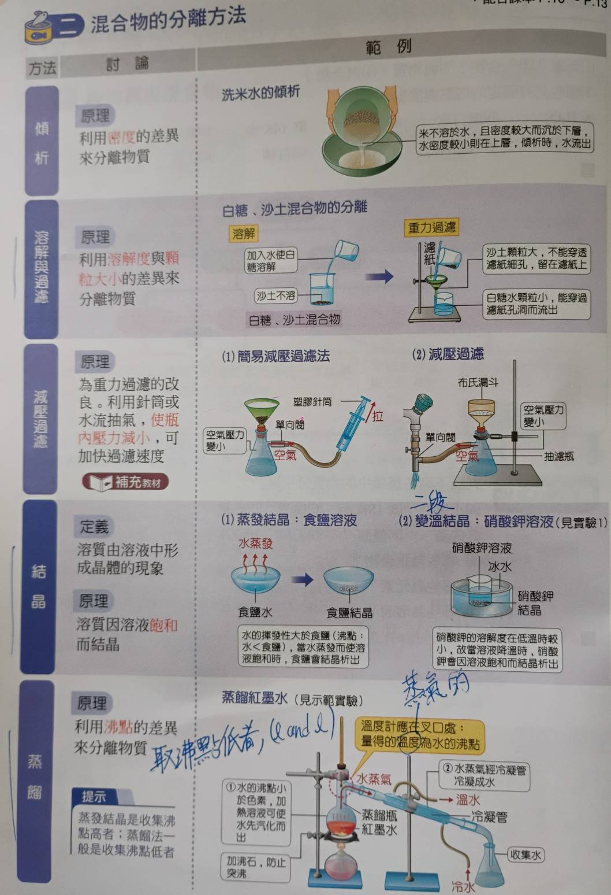
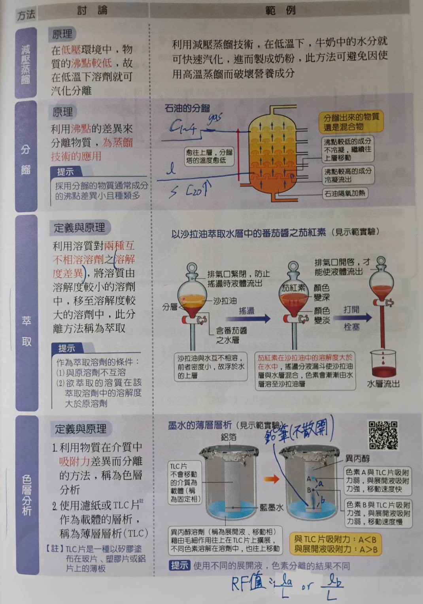
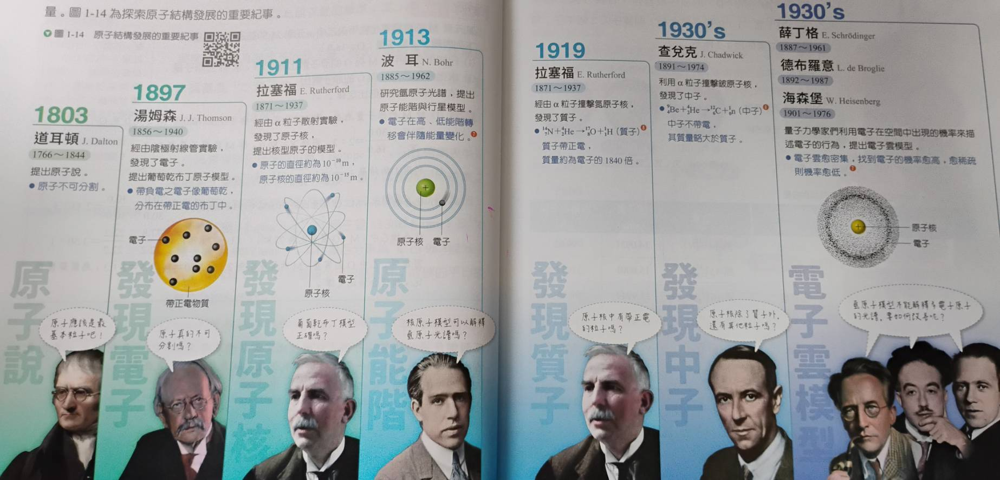
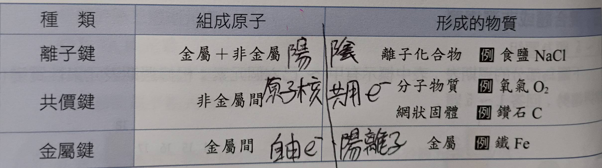
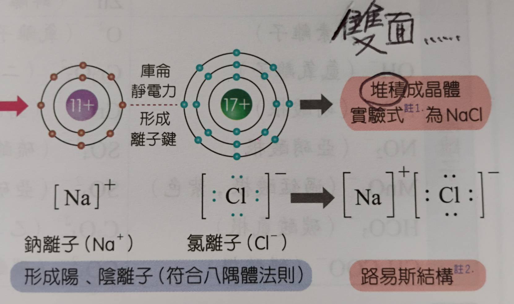
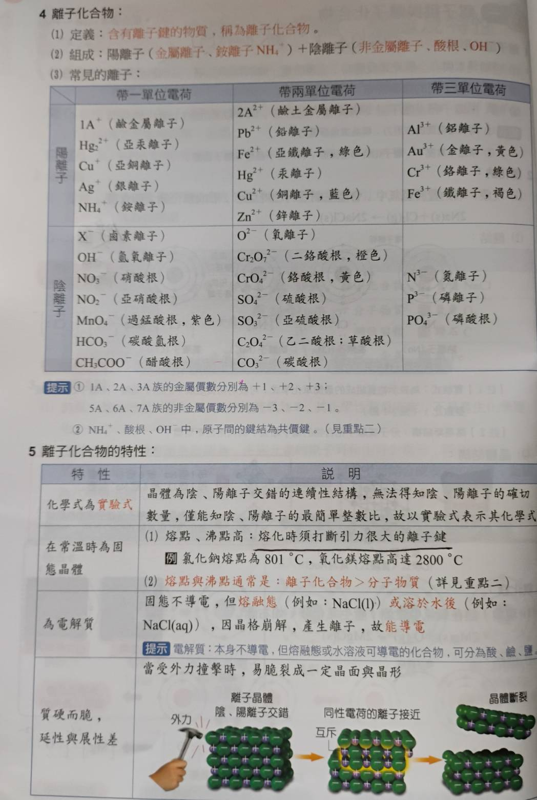

### Cu:
- using 攝氏溫標
- 熔點 = 1085
- 沸點 = 2562
- 密度 = 8.96 $g/cm^3$

## 混合物
- if isinstance 混合物:
  - child = (外觀均勻 ? 均勻混合物 : 不均勻混合物)
- ### 俗稱
  - $C_60: 球狀$
  - $單斜硫S_8, 斜方硫也是S_8, 彈性硫S_{x}$
  - $白磷P_4, 紅磷P_{x}$
  - K金  = Cu + Au
  - 紅銅 = Cu
  - 黃銅 = Cu + Zn
  - 白銅 = Cu + Ni
  - 青銅 = Cu + Sn
- ### 凝相(condense) 
  - 體積固定 => 固態/液態
- ### 流體(fluid) 
  - 外觀上明顯可以流動 => 液態/氣態/超臨界流體
- ### 混合物的分離
- 
- 
- 蒸餾要差15度以上

## 超臨界流體
- 發生於 T > $T_c(臨界溫度)$ && P > $P_c(臨界壓力)$ 時
- 密度像是液體，也可以溶解物質
- 黏度低(像氣體)，流動時的摩擦阻力極小
- 擴散係數比液體高出 10~100 倍，但低於一般氣體
- 氣液介面消失 => 表面張力不存在
- 只要微幅改變溫度或壓力，密度就會發生劇烈變化

物理性質 | 氣體 (Gas) | 超臨界流體 (SCF) | 液體 (Liquid) |
| :-- | :-- | :-- | :-- |
密度 (g/cm3) | $10^{−3}$ | 0.1~0.9 (接近液體) | 1.0 |
黏度 (Pa⋅s) | $10^{−5}$ | $10^{−5}$~$10^{−4}$ (接近氣體) | $10^{−3}$ |
擴散係數 (cm2/s) | $10^{−1}$ | $10^{−4}$~$10^{−3}$ (優於液體) | $10^{−5}$ |
表面張力 | 無 | 無 | 高 |

$E_k = \frac{3}{2}kT$
- $E_k$ (Average Translational Kinetic Energy): 單個分子的平均平移動能
- $k$ (Boltzmann Constant): 波茲曼常數，數值約為 $1.38 \times 10^{-23} \text{ J/K}$(溫度 => 能量)
- $T$ (Absolute Temperature): 絕對溫度(K)

## 相圖
- ### $H_2O$
  - 熔化熱: 80 cal/g = 4.01 kJ/mol
  - 汽化熱: 540 cal/g = 40.7 kJ/mol
  - 三相點(0.006 atm, 0.0098℃)
  - 臨界點(217.8 atm, 373.9 ℃)
- ### $CO_2$
  - 三相點(5.1  atm, -56.5℃)
  - 臨界點(72.9 atm, 31.1 ℃)
  - 昇華點(1.0  atm, -78.5℃)
  - 超臨界態被用於萃取咖啡因
- 正常的固液介面是右傾的，水則是左傾的
- 易昇華物質: $I_2, CO_2, 樟腦, 萘丸$

# 化學定律
- 1774 拉瓦傑提出氧化學說，推翻燃素說，並歸納出質量守恆定律
- 1799 普魯斯特 => **定比定律**
  - 同意化合物不論其來源，元素間質量成定比
- 1803 道耳吞   => **倍比定律**
  - 討論範圍: 固定兩種元素所產生的所有化合物
  - 固定一元素之質量，另一元素之質量間成簡單整數比
- 1803 道耳吞   => **原子說**
  - 一且皆由原子組成，原子不可再分割
  - 相同元素的原子具有相同**質量&&性質**，反之亦然
  - 不同元素的原子可以以間單整數比形成化合物
  - 化學反應式原子重新排列，原子種類&&數目不變
- 1808 給呂薩克 => **氣體化合體積定律**
  - 討論範圍: 同溫同壓下的氣體反應
  - 反應物和產物之間體積成簡單整數比
  - can use PV=nRT explain
- 1811 亞佛加厥 => **亞佛加厥定律**
  - 分子為具該物質的性質最小單位
  - 同溫同壓下同體積的氣體含有同數量的分子

\#define $C_{12}$ 12 amu

# 電子軌域
- enum 電子殼層 {
  - K = 1
  - L = 2
  - M = 3
  - N = 4
  - ...
- }
- enum 電子軌域 {
  - s = 0
  - p = 1
  - d = 2
  - f = 3
  - ...
- }
- 能量 = 主量子數 + 角量子數 (主量子數優先比較)
- 2, 8, 8, 2, 10 ...
- 最外層: 價殼層 ; 最外層的電子: 價電子
- 路易斯結構式要寫成擁有最多不成對電子的形式
- 表示法: ${}_{17}\text{Cl}: 2,8,7$

> 液態元素 only Br && Hg
> 類金屬: 硼矽鍺砷銻碲 (B, Si, Ge, As, Sb, Te)
> 金屬氧化物溶於水 => 酸性，反之亦然
> $CO, NO 不溶於水$
> 週期表左下: 金屬性強 && 原子半徑大
> 鈍氣化合物: $XePtF_6, KrF_2$

