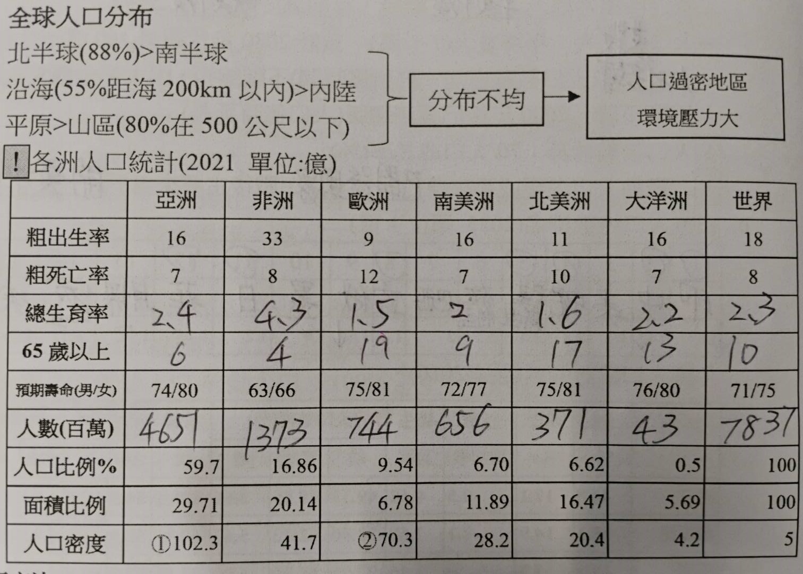
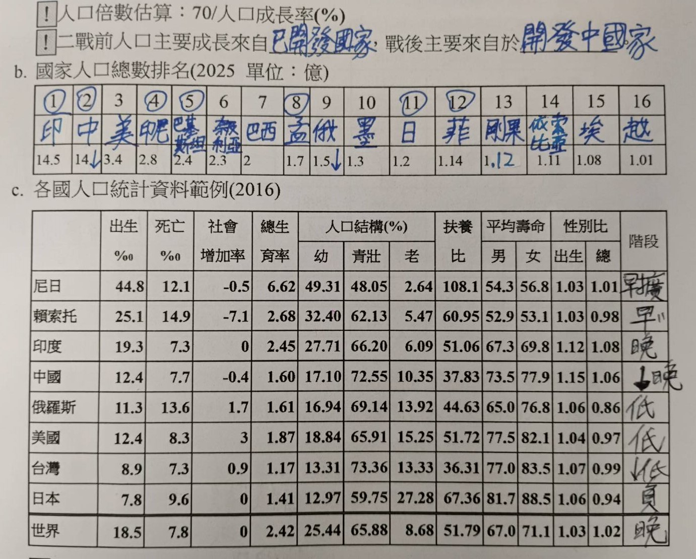
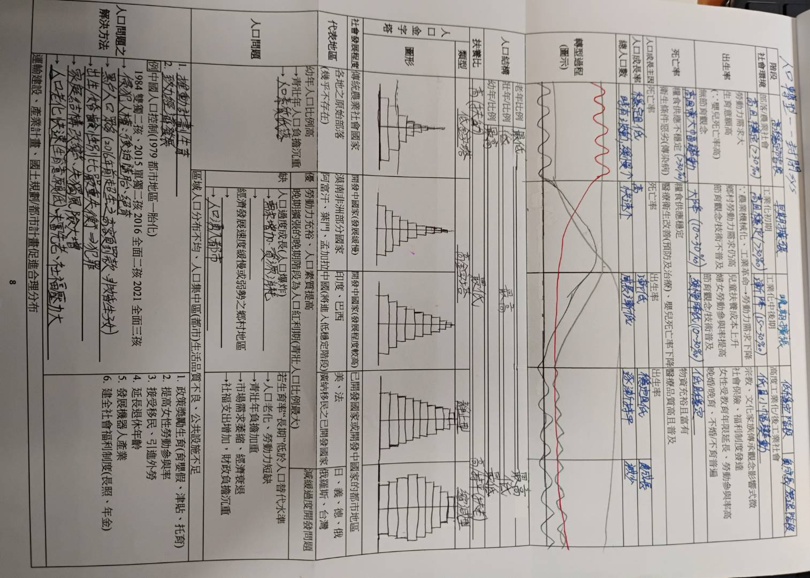

# L1 人口

# 人口數量
- ## 基本定義
  - \#define $年中人口數 = \frac{年初人口數+年終口人數}{2}$
  - \#define $出生率(‰) = \frac{出生人口數}{年中人口數}$
  - \#define $死亡率(‰) = \frac{死亡人口數}{年中人口數}$
  - \#define $移入率(‰) = \frac{移入人口數}{年中人口數}$
  - \#define $移出率(‰) = \frac{移出人口數}{年中人口數}$
- ## 人口系統
  - ### 封閉系統: 
    - 人口數主要受出生/死亡影響，人口遷移低
    - 例如: 世界(人口遷移=0), 台灣
  - ### 開放系統: 
    - 人口遷移因素影響較明顯
    - 例如: 美國(最大移民接收國), 新加坡
- ## 統計指標
  - \#define $自然增加率(‰) = 出生率(‰)-死亡率(‰)$
  - \#define $社會增加率(‰) = 移入率(‰)-移出率(‰)$
  - \#define $人口成長率(‰) = \frac{年末人口數 - 年初人口數}{年平均人口}$
  - \#define $(總)生育率(人) = 15~49 歲婦女平均所生育的嬰兒數$
  - 總生育率要到達**2.1人**(人口替代水準)人口總數才會長期維持穩定
  - 當總生育率剛達到2.1人時，因為**世代重疊**的關係人口仍會上升一段時間
  - 生育陷阱: 生育率 < 0.8 人 $\rightarrow$ 政策無法挽救
  - 嬰兒死亡率較粗死亡率更能評估醫療水準

# 人口組成
- ## 性別結構
  - \#define $性別比 = \frac{男性人口數}{女性人口數}$
  - ### 自然情況
    - 性別比約為 105
    - 青壯年男性多 ; 高齡人口女性多
  - **人口倍時**: 人口增加一倍所需的0時間
- ## 年齡結構
  - 壯年人口: 15~64 歲
  - **扶養比** = $\frac{依賴人口}{勞動人口}$ = 扶幼比 + 扶老比
  - **人口紅利期**: 青壯年人口 $\approx$ 67%($\frac{2}{3}$) $\rightarrow$ 扶養比 < 50%
  - **人口負利**: 扶養比 > 60%
  - 高齡化(7%) : 高齡(14%) : 超高齡(20%)
- ## 人口金字塔 && 人口轉型
- 
- 
- 
- ## 台灣人口統計概況
  - 時間: 2025年12月
  - 總數: 23299132人
  - **結構**: 
    - 幼年:     11.54%
    - 青壯年:   68.40%
    - 老年:     20.06%
  - 原住民: 629456人(2.7%)
  - 移工:   865811人(3.71%)
  - **統計指標**
    - 粗出生率: 4.62‰
    - 粗死亡率: 8.58‰
    - 生育率:   0.87人 (世界最低)
  - 平均初婚年齡: 
    - 男性: 32.9歲
    - 女性: 31.0歲
  - 婦女生育第一胎平均年齡31

# 人口分布
- **可耕地人口密度**: $\frac{人口總數}{人可耕地面積} \rightarrow 推估環境負載力$
- **難民**: 沒做好準備的非自願人口遷移
- ## 推拉理論
  - 原居地 -> 推力
  - 目的地 -> 拉力
  - 中間障礙
    - 距離
    - 費用
    - 語言
    - 文化
    - 法規
    - 個性
  - 遷移案例
    - 二戰前: 舊大陸 -> 新大陸
    - 二戰後: 開發中國家 -> 已開發國家

註: 人口點子圖應使用等積投影法(莫爾威) 
