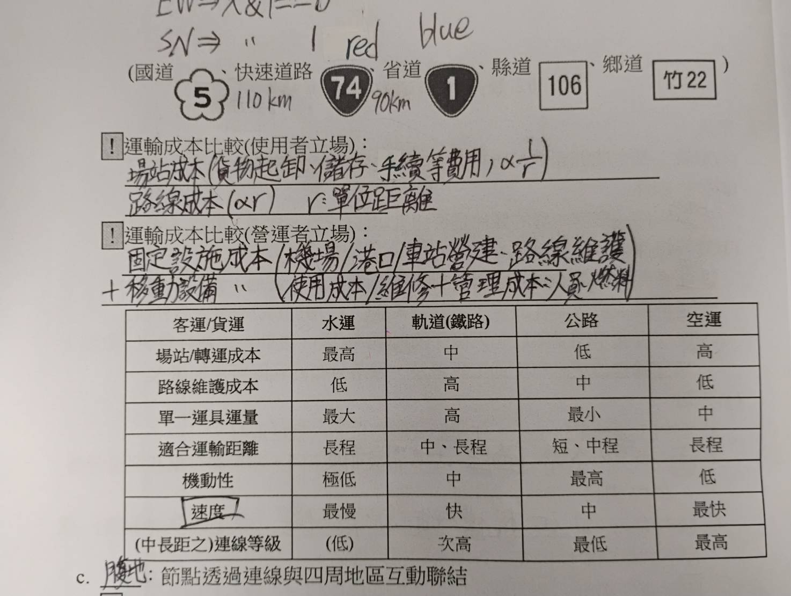
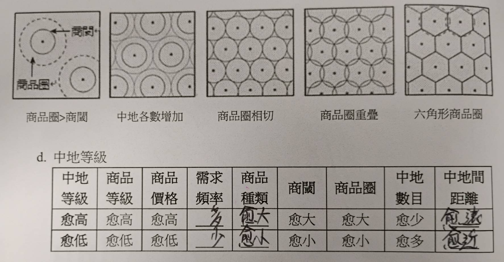

# L2 聚落、流通路線與區域

# 聚落
- ## 條件
  - #### 地點條件
    - 聚落本身是否宜居(水/食物/安全...)，是聚落的發生條件
  - #### 位置條件
    - 聚落對外聯絡的便利程度(交通/資訊化...)，是聚落的發展條件
- ## 分類
  - ### 鄉村
    - **集村**: 建築物聚集
    - **散村**: 建築物分散
  - ### 都市
    - 以人口規模/人口規模/就業結構定義，景觀相似度高
    - **計畫性都市**: 新德里/巴西利亞/坎培拉
- ## 交通系統
  - ### 運輸革新
    - #### 時空輻輳
      - 又稱時空收斂/時空壓縮
      - 兩地通勤時間因交通發展而縮小的現象
    - #### 時空輻散
      - 較近的地區因交通不便，交通時間反而比到遠方更久的現象
  - ### 資訊革新
  - ### 運輸要素
    - **節點**: 起點/終點/轉運站
    - **連線**: 水/陸/空運/管線
    - 註: 連線等級和路權優先性&可及性有關
  - 
  - **腹地**: 節點透過連線可以(高度)連結的範圍
- ## 中地理論
  - 1933 克里斯徒勒提出
  - ### 假設
    - 1. 均質平原
    - 2. 理性消費者
  - ### 定義
    - \#define 中地 提供商品或服務的地點
    - \#define 商閾 中地能維持營運的最小服務範圍
    - \#define 商品圈 消費者願意購買商品或接受服務的範圍
    - 商品圈大小和交通便利程度呈**正相關**
    - 和利益的關係
      - 商品圈 > 商閾 $\rightarrow$ 盈利, 中地少
      - 商品圈 < 商閾 $\rightarrow$ 打平, 中地普
      - 商品圈 = 商閾 $\rightarrow$ 倒閉, 中地多
  - 
  - 可以做為選址參考
