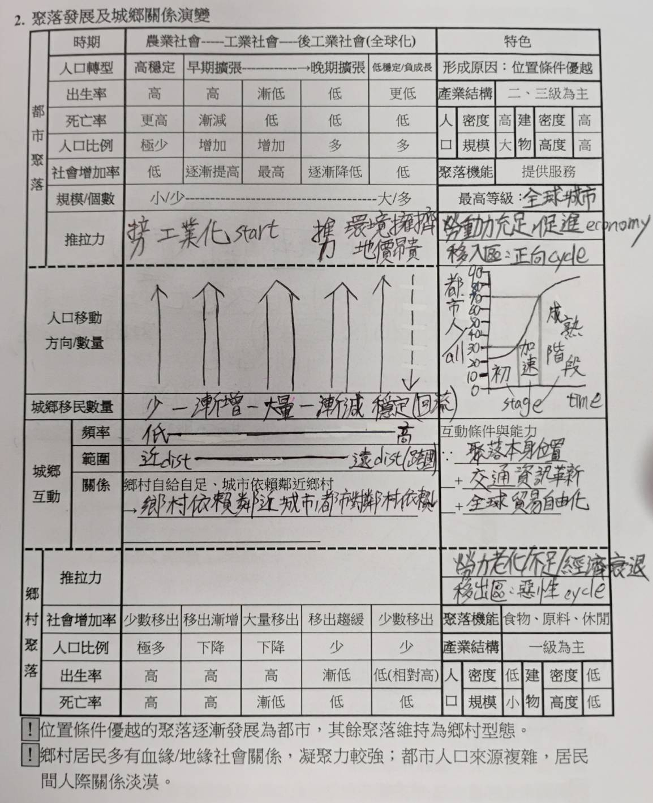

# L3 都市

\#define 都市人口 都市人口總數
\#define 都市成長 都市人口的自然增加數

# 都市化
- 聚落**二、三**級產業日漸集中且增加就業機會
- $\rightarrow$ 開始有社會增加
- ### 動力
  - 1. 工業化
  - 2. 農業機械化
  - 3. 交通革新(助力)
- ### 遷移方向
  - **封閉系統**: 鄉村 $\rightarrow$ 都市
  - **開放系統**: 開發中國家 $\rightarrow$ 已開發國家
- ### 都市化歷程
  - 初期階段 $\rightarrow$ 加速階段 $\rightarrow$ 成熟階段
  - #### 現況 
    - 開發中國家 $\rightarrow$ 加速階段
    - 已開發國家 $\rightarrow$ 成熟階段
  - ### 都市化程度
    - 都市化程度(%) = $\frac{都市人口數}{總人口數}$
    - 2023年全球都市化程度: 57.5% 
    - 和經濟發展程度呈正相關 $\rightarrow$ 成長主要來自開發中國家
  - ### 假性都市化(偽都市化)
    - **定義**: 都市化程度和經濟發展程度不成比例
    - #### 原因
      - 鄉村過窮(無法生存)
      - 都市表面繁榮(工作機會多)
    - 主要發生於**中南美洲**
    - #### 結果
      - 都市無法負荷這麼多人
      - $\rightarrow$ 形成巨大貧民窟
      - $\rightarrow$ 非正式經濟盛行
      - ...

# 聚落發展 & 城鄉關係
- 

# 都市的擴張與機能
  - **半都市化地區**
  - **都市擴張**: 建物增加+交通革新 $\rightarrow$ 往郊區擴張
  - ## 郊區化
    - **成因**: 人口和產業過度集中，市中心環境惡化
    - **條件**: 交通改善(汽車自有率提高 & 大眾運輸...)
    - **過程**: 
      - 1. 工廠郊區化(需大量土地)
      - 2. 住宅郊區化(居住環境較佳)
      - 3. 商業服務郊區化(郊區需求增加)
    - **結果**
      - 1. 通勤圈擴大，市中心人口$\downarrow$，住商分離
      - 2. 市中心成為**高級商業**區，多企業總部/核心部門...
  - **都會區**: 鄰近的都市相連形成
  - **都會帶**: 鄰近的都會區相連形成
  - ## 都市機能判別
    - #### 就業人口總數法 (少用)
      - 單純城市中最多人的產業
    - ### 區為商數法(Location Quoteint)
      - $LQ(區位商數) = \frac{ei/e}{Ei/E} = \frac{i行業就業人口數佔該都市總就業人口數之比例}{i行業就業人口數佔該國總就業人口數之比例}$
      - **LQ意義**
        - LQ > 1:  某行業相對集中(專業化機能)，可以提供室外居民服務
        - LQ == 1: 普通
        - LQ < 1:  需依賴其他城市服務
        - 若所有產業皆 LQ <= 1 則為自給自足

# 都市體系
- 
