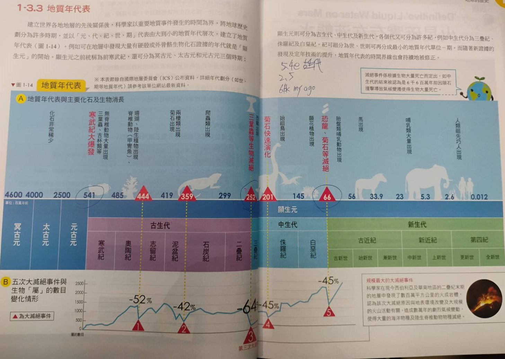

# 太陽系的形成
- ## 太陽星雲假說
  - **46億**年前太陽，太陽系是太陽**星雲**
    - #### 星雲
      - 地科老師: 約 $\frac{3}{4}$ 是氫 $\frac{1}{4}$ 是氦
      - [網路資料](url1): 90%是原子或分子氫 9%為氦
      - 較重元素 (最重是鐵) 就是所謂的 "塵埃"
    - ### 太陽系形成過程
      - 星雲塌縮而旋轉加速，形成**圓盤結構**
        - 星雲並非靜態，本就帶點旋轉
        - 物質因角動量守恆，被扁平化到旋轉面 
        - $$L = m r v = m r^2 \omega$$
        - $$v = \frac{L}{mr}$$
        - 垂直方向上，質點只受到引力 $F_g$ 的作用
        - $$F_{g,z} = -\frac{G M m}{z^2}$$
        - 旋轉平面上，質點同時受到引力和離心力$F_c$影響
        - $$F_g = \frac{G M m}{r^2}$$
        - $$F_c = \frac{m v^2}{r}$$
        - 將角動量守恆 $v = \frac{L}{mr}$ 代入
        - $$F_c = \frac{m (L/mr)^2}{r} = \frac{L^2}{m r^3}$$
        - 當離心力和引力平衡時: 
        - $$\frac{G M m}{r^2} = \frac{L^2}{m r^3} \implies r = \frac{L^2}{G M m^2}$$
      - 質量聚集 -> 溫度升高 (位能轉動能)
        - 維里定理 (Virial Theorem)
        - $$2K + U = 0$$
        - U是位能(負值) K是總動能∝溫度
      - 中央溫度高到足以發生核融合 (氫->氦) 之後太陽形成
      - 其他氣體和塵埃則碰撞形成 行星/小行星/衛星/...其他太陽系小天體
    - ### 行星種類 
      - #### 類木行星
        - 由氣體和冰組成
        - 成分在宇宙中豐度較高，但是無法接近太陽
      - #### 類地行星
        - 由金屬和岩石組成
        - 雖然原料少，但是可以存在於接近太陽的地方
- ## 大氣與海洋的形成
  - ### 原始大氣
    - 主要來源: 太陽系剛形成時的遺留物
    - 主要成分: $H_2$ $He$ $CH_4$ $NH_4$
    - 前兩者($H_2$和$He$)因為過輕而散逸到太空中
    - 後兩者($CH_4$和$NH_4$)被高能輻射分解為**次性大氣**的成分之一
  - ### 次性大氣
    - 主要來源: 地球冷卻後容於火山岩漿中的氣體析出
    - 主要成分: $H_2O$ $CO_2$ $SO_2$ $N_2$ $Ar$
    - \[約40億年前\] $H_2O$冷卻凝結形成原始海洋
      - 原始海洋溶解了大氣中的$CO_2$和$SO_2$
    - \[約35億年前\] 藍菌光合作用形成$O_2$
    - 註: 藍綠菌約誕生於35億年前
  - ### 現代大氣
    - 主要來源: 次性大氣遺留 + 藍菌光合作用產生的氧氣
    - 主要成分: $N_2$ $O_2$ $Ar$
    - \[約20億年前\] 氧氣開始在大氣中堆積
    - \[約04億年前\] 臭氧層產生
  - ### 原始海洋
    - 主要來源: 約40億年前大氣中的$H_2O$冷凝而成
    - 主要成分: $H_2O$ 碳酸根 硫酸根...
    - pH值不到3 + 酸雨的侵蝕，溶解出大量的金屬陽離子(from 矽酸鹽礦物)
    - 因為含氧量低，含有大量$Fe^{2+}$形成紅褐色的帶狀鐵礦
  - ### 現代海洋
    - 主要成分: $H_2O$ 鹽類 
    - \[約18億年前\] $Fe^{2+}$幾乎全數氧化成$Fe_2O_3$
    - 陰離子來自火山;陽離子來自岩石 -> 中和

# 地質年代
- "地質學之父"詹姆斯-赫登提出**均變說**
  - #### 均變說
    - 現在就過去的鑰匙
    - 現在發生的是可以作為判斷過去的依據
  - ### 標準化石
    - 18世紀地質學家研究的成果
    - **條件**: 
      - 生存期限短
      - 分佈範圍廣
      - 個體數量多
      - 特徵易鑑定
      - 演化速度快
    - 可以用於劃分地質年代
  - #### 放射性元素
    - 子元素: 已衰變後的產物
    - 母元素: 尚未衰變的物質
  - ## 地質年代表
    - ### 大事件
      - [約5.41億年前] 古生代(顯生宙) start, **寒武紀大爆發**(三葉蟲...)
      - [約2.52億年前] 第三次大滅絕，三葉蟲滅絕/恐龍出現，中生代開始
      - [約6.6k萬年前] 第五次大滅絕(小行星理論)，恐龍&菊石滅絕，新生代開始
    - 

[url1]: http://sprite.phys.ncku.edu.tw/astrolab/e_book/star_birth/star_birth.html 
