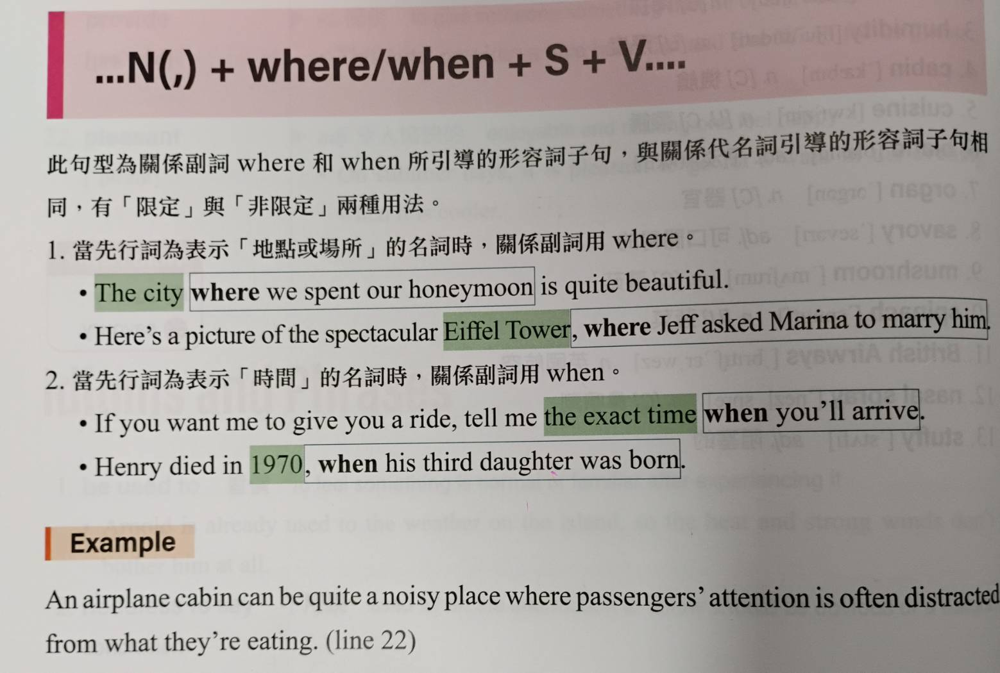
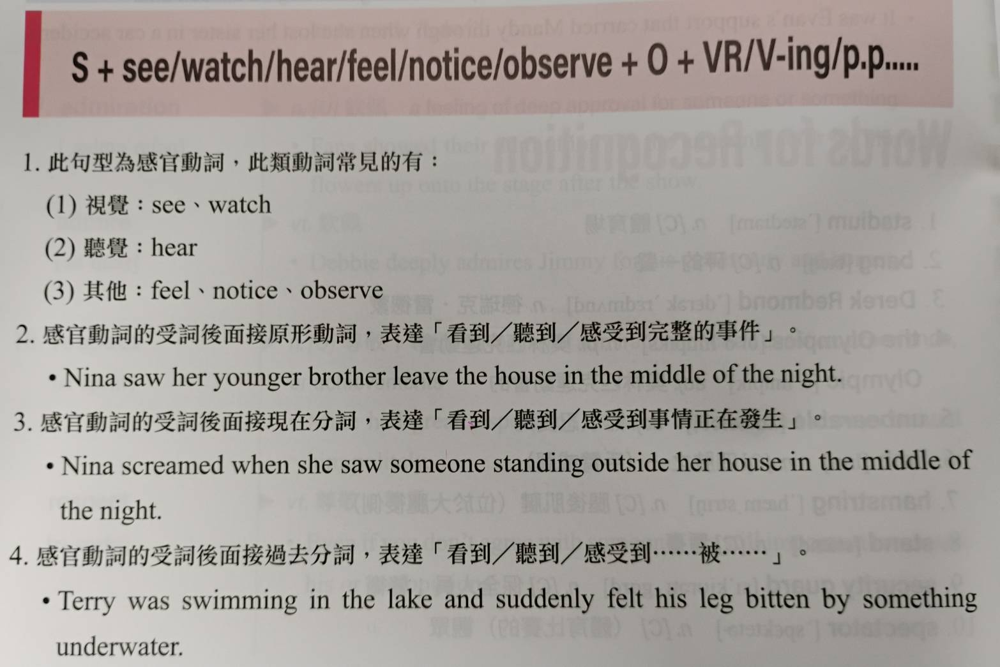
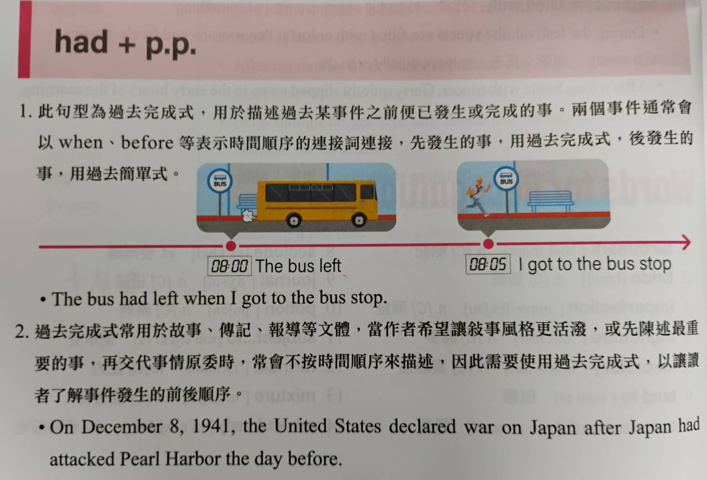

## 感官動詞
- ### 用法
  - 1. +Ving 表示(感覺到)某事正在發生(片段)
  - 2. +VR   表示完整的(感覺到)某事發生
  - 3. +p.p  表示被動語意
- 1. ### ...起來
  - look, sound, smell, taste, feel
- 2. ### 課本上的
  - hear, listen, smell, feel, notice, observe
