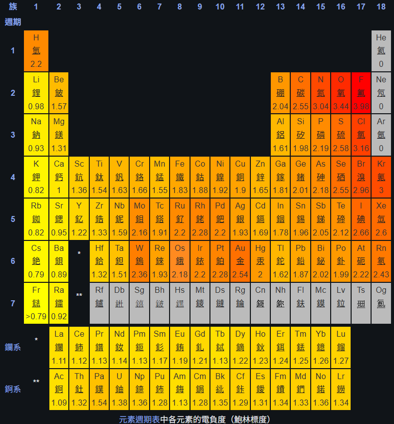
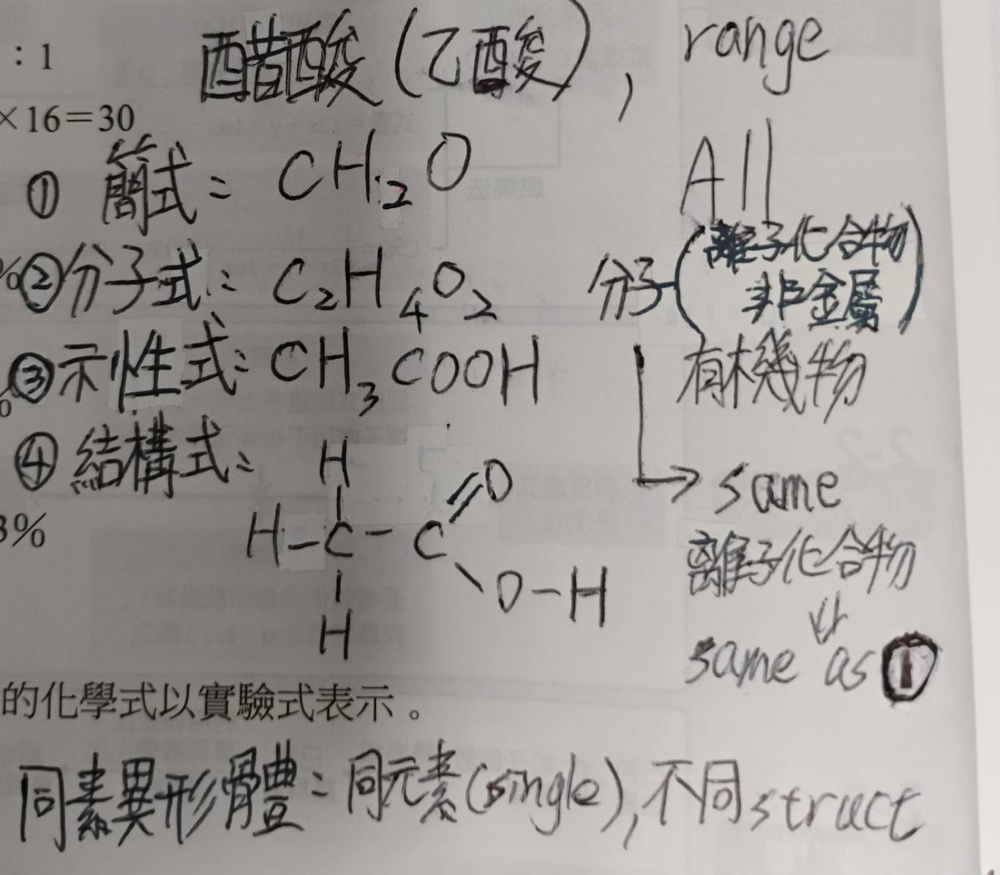
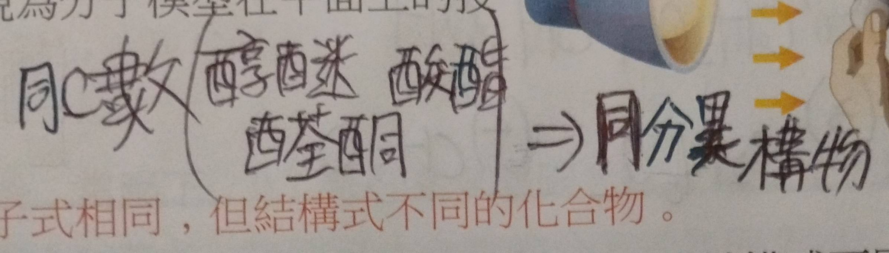
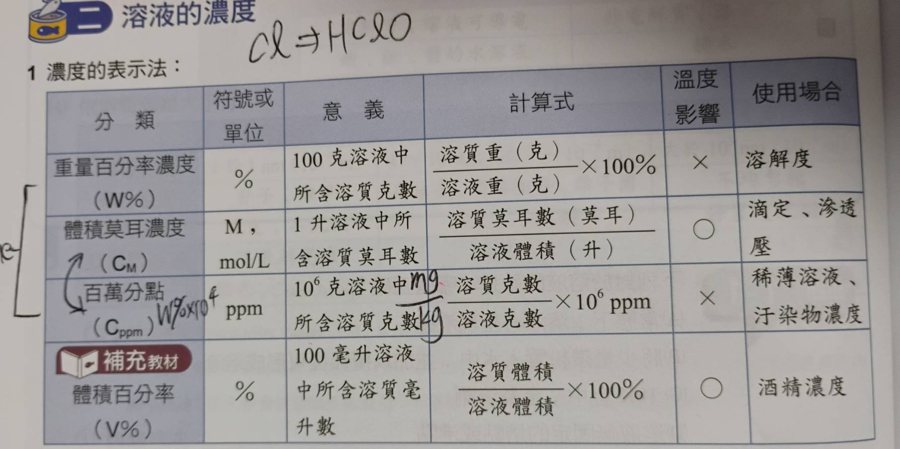
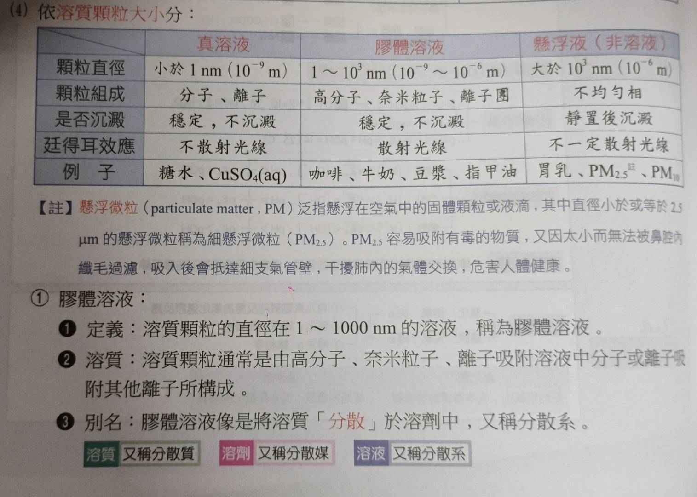

# 化學鍵
- ### 惰性氣體化合物
  - Kr/Xe/Rn 的化合物已經被合成
    - 1. $XePtF_6$
    - 2. $KrF_2$
- ### 電負度
  - #### 使用前提
    - 常溫常壓，並非理論產物
    - 形成鍵結(不同於電子親和力)
    - 價電子層沒有滿且電負度固定
    - 假設內層電子屏蔽效果是穩定
  - 金屬電負度小;非金屬電負度大
- 
- ### 陌生離子列表
  - +1價: 
    - $Hg_{2}^{2+}(亞汞離子), Cu^{+}(亞銅離子), Ag^{+}$
  - -1價:
    - $NO_{2}^{-}(亞硝酸根), MnO_{4}^{-}(過錳酸根)$
  - +2價:
    - $Hg^{2+}(汞離子), Fe^{2+}(亞鐵離子)$
  - -2價:
    - $C_{2}O_{4}^{2-}(草酸根), SO_{3}^{2-}(亞硫酸根)$
  - +3價:
    - $Au^{3+}(金離子), Cr^{3+}(鉻離子)$
  - -3價
    - $PO_{4}^{3-}(磷酸根)$
- ### 物質最穩定狀態
  - 1. 第1週期2顆電子
  - 2. 23週期八隅體
  - 3. 第4週期:
    - $4s<3d<4p$
    - 非常混亂，18電子原則
- ### 物質顏色
  - Cu紅色, Au金色
  - 金離子黃色, 鉻離子綠色, 鐵離子褐色
  - 亞鐵離子綠色, 銅離子藍色
  - 鉻酸根黃色, 二鉻酸根綠色
  - 過錳酸根紫色
  - $P_4$ 白色氣體
- ## 三大鍵結模式
- 不討論共價網狀固體
- 氣態時金屬沒有鍵結，也不導電  

| 性質 | 金屬鍵(Metallic) | 離子鍵(Ionic) | 共價鍵(Covalent) |
| :-- | :-- | :-- | :-- |
| 引力來源 | 自由電子 & 陽離子 | 陰離子 & 陽離子 | 原子核 & 共用電子 |
| 電子狀態 | 自由流動 | 完全轉移 | 共享(可能偏一邊) |
| 熔沸點(°C) | 範圍大 | 高 | 低 |
| 導電性 | 極佳 | only固態不導電 | only電解質導電 |
| 導熱性 | 極佳(自由電子傳遞) | 差(絕緣體) | 差(絕緣體) |
| 延展性 | 極佳 | 不佳 | 不佳(鍵結具方向性) |
| 硬度 | 硬 | 硬 | 軟 |

- ## 共價網狀固體
  - ### 種類:
    - 元素: $B,C(鑽石),C(石墨),Si$
    - 化合物: $SiO_2(石英),SiC(碳化矽),BN(淡化硼)$
  - 熔點至少3000℃
  - 具有連續性延伸結構
  - 只有石墨導電，C(鑽石/石墨)導熱
  - 鑽石/Si: 正四面體
  - 石墨: 六角形(蜂巢)
  - $SiO_2$: 正方形矽晶格中，邊上插入氧
  - 極硬，引力極強，不具延展性，難溶於水
# 化學式
- ## 燃燒分析法
  - 經過兩個U型管吸收
  - $Mg(ClO_4)_2$ 吸收 $H_2O$
  - $NaOH$ 吸收 $CO_2$
- 

# 其他
- 導電度: 銀>金>銅...
- 鍵級=鍵數=鍵序=單鍵/雙鍵...
- 路易斯結構可能有多種畫法，須配合實驗驗證
- 反應熱 = 末-初 = 產物能量-反應物能量 (單位kJ)
- 反應熱: 放熱反應為負，吸熱反應為正
- 廷得耳效應: 膠體溶液會散射光線

