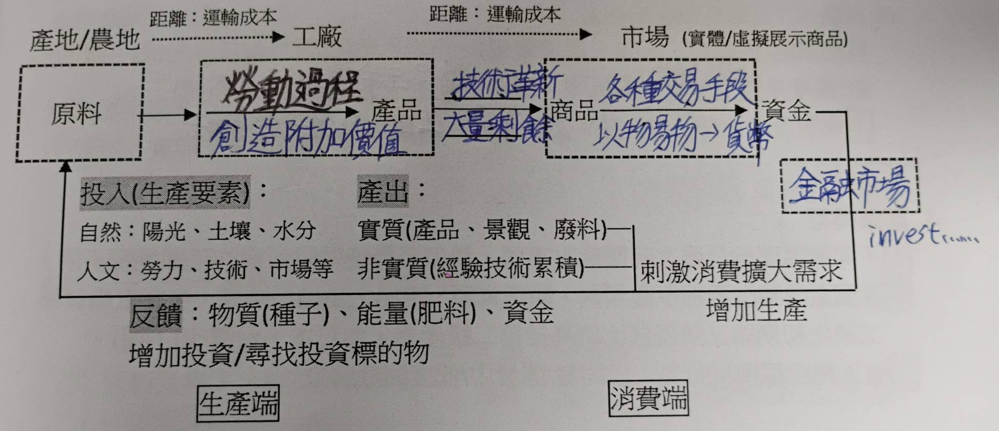
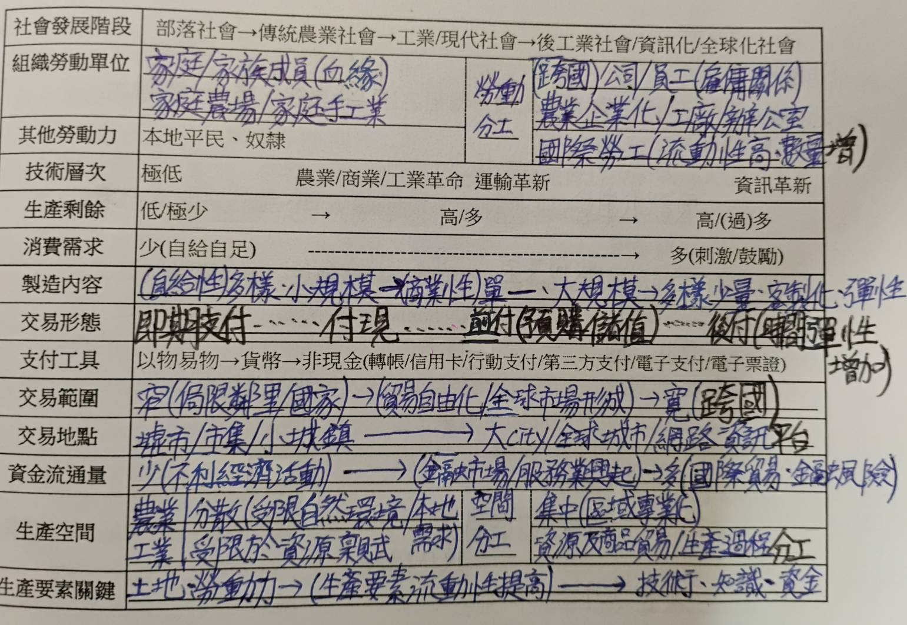
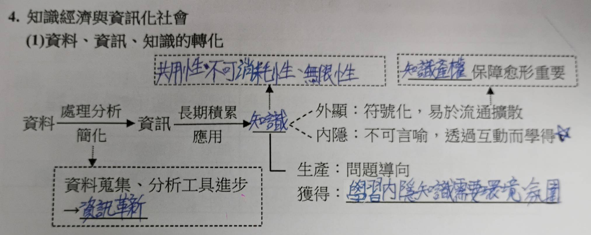
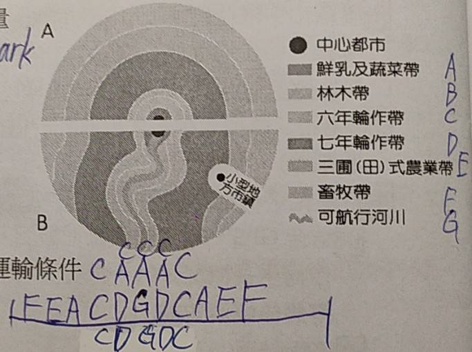
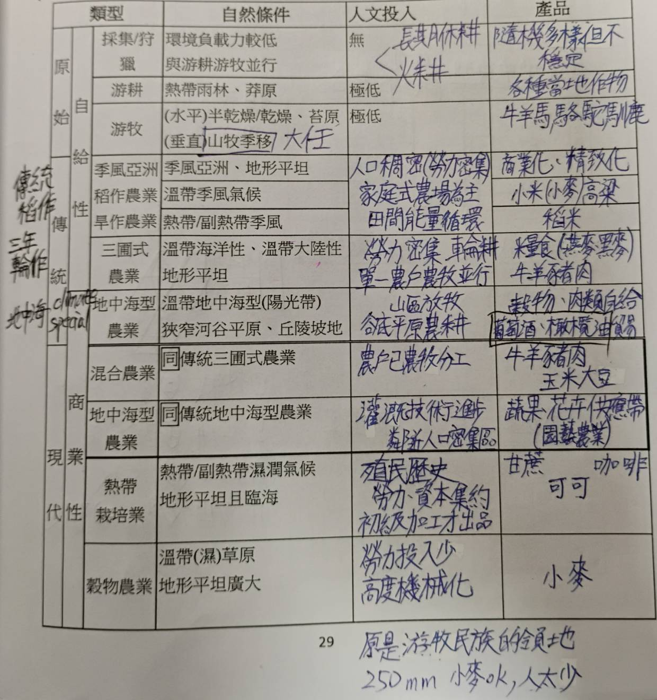
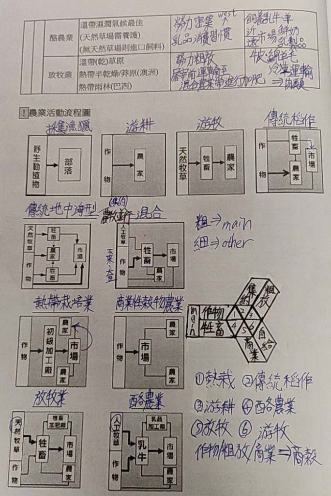

# L4 產業活動
- ## 生產系統
  - 
  - ### 投入
    - **區位**: 產業利潤最大的發展位置
    - **附加價值**: 產品生產中所創造的價值
    - 農業研發成本高，不可能由農民負擔 -> 政府需協助
  - ### 產出
    - **正向產出**: 有價值的產品
    - **負向產出**: 外部性(各種汙染&廢物)
    - 若生產者不處理負向產出，將成為**公害**
    - #### 循環經濟
      - 不賣產品，改賣服務
      - 從搖籃到搖籃的設計
  - ### 反饋
    - 生產者再投入生產的動力
    - 若反饋消失則生產停滯，導致惡性循環
  - ### 風險
    - 含自然風險/市場風險...
    - **農業**: 時間長 -> 遇到天災機會大
    - **工業**: 產品生命週期短 -> 被新產品取代
  - ### 產業轉型(工業化)
    - 
- ## 知識經濟
  - 
  - 以知識和創意為獲利來源，促進人才流動，不受時空限制
  - #### 影響
    - 軟硬體製造服務業成為主流
    - 技術革新 -> 產品週期縮短，競爭加劇
    - 生產者服務業需求大增，非實體店面興起
  - ### 資訊革新
    - **定義**: 資料(儲存/處理/傳播)速度大幅增加
    - **影響**: 資訊落差/資訊化社會/面對面互動更加重要
- ## 第一級產業: 初級原料業
  - #### 基本農產品特性
    - 稻米: 高溫潮溼
    - 小麥: 涼爽乾燥
    - 玉米: 陽光/溫暖/排水好
  - **區域專業化**: 田地集中，作物單一，互相合作
  - ### 農業區位論
    - **假設**: 
      - 均質平原
      - 同心圓中心為市場
      - 商業化(唯利是圖)
    - 競租能力 LR = Y(m-c-td)
    - **結果**:
      - 越靠內側集約度越高
      - 由內到外: 酪農業/小麥/放牧/荒地
      - 由市中心向外: 粗放 -> 集約 ->粗放
      - 即將成為都市的地區反而較粗放(預期心理)
      - 都市發展潛力臨界處集約程度最高
    - 
  - ### 農牧業類型
    - 
    - 
  - ### 綠色革命
    - 第一次(1960s): 育種(提高產量) + 推廣化肥和灌溉
    - 第二次(1970s): 基改作物大規模商業化生產，控制病蟲害有成
- ## 第二級產業: 加工製造業
  - ### 工業變革
    - 工業 1.0(1760s): 瓦特發明蒸汽機 -> 開始機械化
    - 工業 2.0(1870s): 開始利用電力、生產線專業分工
    - 工業 3.0(1950s): 數位變革，電腦普及 -> 自動化
    - 工業 4.0(1950s): 大數據+物連網+AI -> 智慧工廠
    - 工業 5.0(2021): 人機協作，提升創造力
  - ### 現代化工業
    - **產業連鎖**: 廠商間因生產和服務產生的連鎖關係(空間集中以降低成本)
    - **工業慣性**: 環境改變時，廠商因既有的(知名度/勞力庫...)而不搬遷
    - **範圍經濟**: 透過增加產品種類或投入其他領域降低單位生產成本
    - **福特主義**: 生產線上分工(泰勒化)，將作業流程分解並標準化
    - **聚集經濟**: 同業空間鄰近 -> 共同分攤成本/共享客源...
    - **規模經濟**: 透過擴大生產規模降低單位生產成本
    - **產品標準化**: 用相同流程生產產品，以利於做品管
    - **產品規格化**: 不同廠商生產相同規格的產品(Type-C...)
    - **水平分工**: 產品的各個原料分工製造
    - **垂直分工**: 上中下游之間的分工
    - **水平整合**: 與同業整合
    - **垂直整合**: 上中下游之間的整合
  - ### 工業區位論
    - **失重率**: 產品加工完後減少的重量百分比
    - **假設**: 加工製造成本無區位差異，僅考慮原料特性(失重率...)
    - **結論**: 最佳地點為總運費最低的地點
    - 1. 
  - 
- ## 第三級產業: 知識與服務
