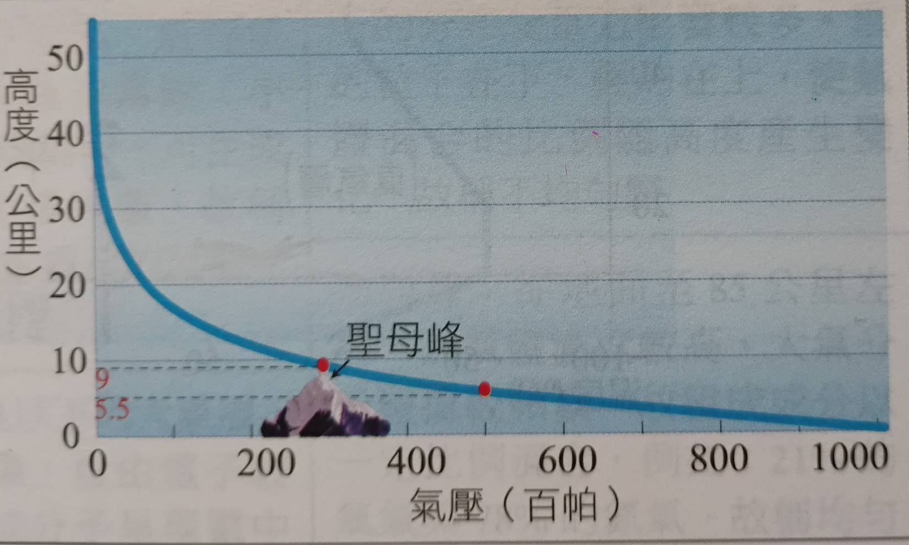
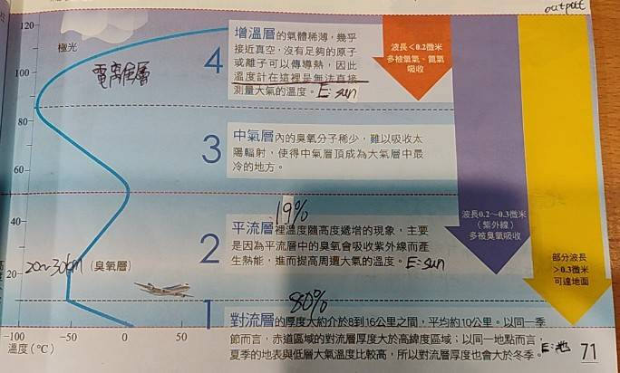
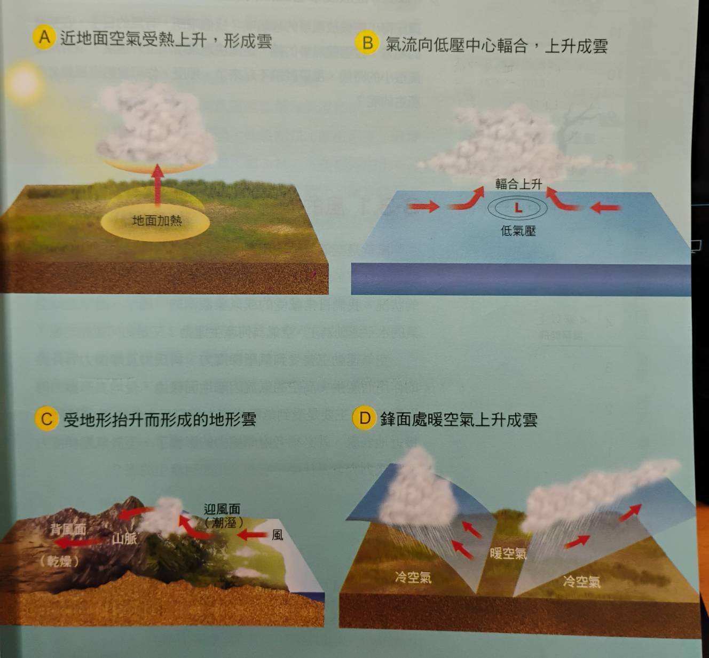
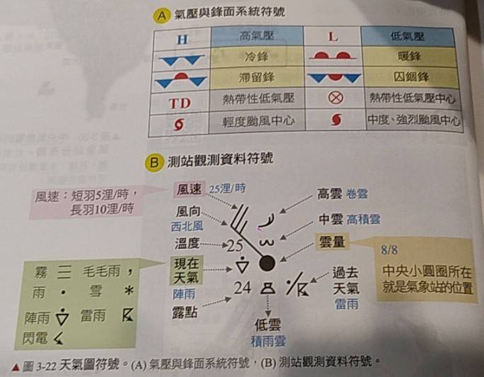
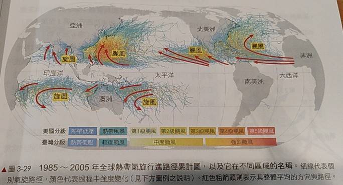

# Ch3 大氣

# 大氣的溫壓垂直結構
- ### 氣壓的定義
  - 定義: 單位面積上空氣柱的總重量
  - 單位: 帕斯卡($N{\cdot}m^{-2}$)
  - #### 標準大氣壓(atm)
    - 1atm = 76mmHg = 1013.25 hPa(百帕)
    - 定義: 緯度45°溫度0°C海平面上的氣壓
- ### 垂直氣壓分布
  - 50% 的空氣聚集在 5.5  km 以下
  - 70% 的空氣聚集在 9.0  km 以下
  - 99% 的空氣聚集在 50.0 km 以下
  - 
- ## 垂直氣溫變化
| | 增溫層 | 中氣層 | 平流層 | 對流層 |
| :-- | :--: | :--: | :--: | :--: |
| 高度(km) | 85$\uparrow$ | 85~50 | 50~$(12\pm4)$ | $(12\pm4)\downarrow$ |
| 熱量來源 | 太陽輻射 (波長<200nm的紫外線) | 平流層的熱量 | 臭氧層吸收的紫外線 (波長200~300nm) | 地表紅外線輻射 |
| 氣溫/高度的關係 | 正相關 | 負相關 | 正相關 | 負相關 | 
| 是否屬於電離層 | 是 | 是 | 否 | 否 |
| 是否為均勻相 | 否 | 是 | 是 | 是 | 
| 其他 | 空氣稀薄，溫度極高 帶電粒子碰撞氣體分子產生極光 溫度計量不到溫度(PV=nRT推算) | 頂部可達-90°C(最冷) | 上熱下冷不易對流 20~30公里處為臭氧層 | 對流旺盛 赤道&夏天厚度較厚 頂部溫度落在(-55~-60)°C之間
- 
- ## 大氣的能量收支
  - 顯熱: 溫度改變所放出的熱量
  - 潛熱: 相態改變所放出的熱量
    | 計算項目 | 數值 | 總和 |
    | :--: | :--: | :--: |
    | 地表收入 | 160(太陽輻射)+342(大氣輻射) | 502 $W/m^2$ |
    | 地表支出 | 398(輻射)+82(潛熱)+21(顯熱) | 501 $W/m^2$ |
  - 溫室效應: (502-501 = 1) $W/m^2$ 能量收支不平衡，溫室氣體吸收地表紅外線輻射
  - 地表反照率: 反射光能量/入射光能量 = 約29%, 光壓 $P = I/c \propto T^4$

# 大氣中的水氣變化
- ## 統計指標
  - ### 絕對溼度(AH)
    - 定義: 單位體積空氣所含的水氣質量
    - 單位: $g \cdot m^{-3}$
    - 一般而言在 0%~4%
  - ### 相對溼度(RH)
    - 定義: $\frac{實際水氣壓(hPa)}{飽和水氣壓(hPa)}$
    - 50%以下表示乾燥;70%對於人類剛剛好
  - ### 露點溫度 $(T_d)$
    - 定義: 在相同水氣壓下，水氣達飽和時溫度
- ## 指標之間的關聯
  - $實際水氣量 \propto 絕對溼度 \propto 相對溼度 \propto 露點溫度$
  - ### 絕熱膨脹時的溫度變化
  - 乾絕熱垂直增溫率: -9.8°C/km
  - 濕絕熱垂直增溫率: -6.0°C/km
- ## 雲的形成
  - 形成順序: $凝結核(10^{-7}m) -> 雲滴(10^{-5}m) -> 雨滴(10^{-3}m)$
  - #### 四大成雲方式
    - 

# 大氣的運動
- 蒲福風級: 分為12級
- ### 兩種空氣運動
  1. 風:    大氣水平運動
  2. 對流:  大氣垂直運動
- 重力=垂直氣壓梯度力 -> 靜力平衡
- ## 科氏力
  - 高度越高，摩擦力越小，科氏力越明顯
  - 緯度越高，地球自轉半徑差越大，科氏力越明顯
  - 風向: (氣壓梯度力+科氏力)方向，和等壓線夾一點點角度

# 天氣圖判讀
- 
- 冬季特徵: 強烈高壓(大陸)
- 夏季特徵: 低壓往大陸推進
- 梅雨季特徵: 低壓高壓相間+滯留峰

# 颱風
- ## 形成條件
  1. 海面溫度 26.5°C 以上
  2. 需有初始的輻合渦旋(高空則是輻散)
  3. 中低對流層濕度要高(水分充足)
  4. 緯度須 > 5° 讓科氏力協助形成氣旋
  5. 上下大氣風向和風速差異不大(水氣上升凝結釋放潛熱)
- ## 形成過程
  1. 初始熱帶擾動產生
  2. 大氣開始輻合，形成積雨雲，高空開始輻散
  3. 地壓中心上方水氣釋放潛熱，加強對流，吸引水氣集中
  4. (水氣集中->海面氣壓更低->環流更強)循環->輕颱形成
  5. 颱風眼形成，外圍下沉氣流出現，結構間隔著垂直升降的區域，風雨時強時弱
- 
- ## 完美颱風的結構
  - **由內到外，由低到高**
  - 大小: 垂直數公里，水平上百公里
  - 颱風眼: 微弱的下沉氣流，空氣增溫(離心力)
  - 眼牆: 上升氣流最強，雨勢最大，風速最快(角動量守恆)
  - 螺旋狀雲雨帶: 離眼牆越遠，風速越慢，雨勢越小，上升氣流越弱
  - 註: 螺旋狀雲雨帶的上升氣流是一圈一圈的，中間有間隔
  - 最後是外圍下沉氣流
- ## 共伴效應
  - 由於涉及東北季風，因此秋季為主，會造成颱風還沒到時風雨就很強
  - 颱風逆時針旋轉 + 東北季風吹拂 -> 輻合作用更強
  - 台灣北部地形抬升，造成更容易降雨
- ## 藤原效應
  - 由較強的颱風主導，路徑詭異
  - 兩個颱風繞著加權中心點逆時針旋轉
- ## 西北颱
  - 指經過基隆/彭佳嶼之間海面，並向西北西行進的颱風
  - 無屏障: 此情況下中央山脈無法起到擋風的作用，風勢強勁
  - 台灣北部會吹西北風，風向和淡水河口反向，導致海水倒灌，河水無法排入大海
- ## 長尾效應
  - 颱風引進水分充足的西南氣流，造成颱風遠離後，仍持續強降雨(88風災就是)
