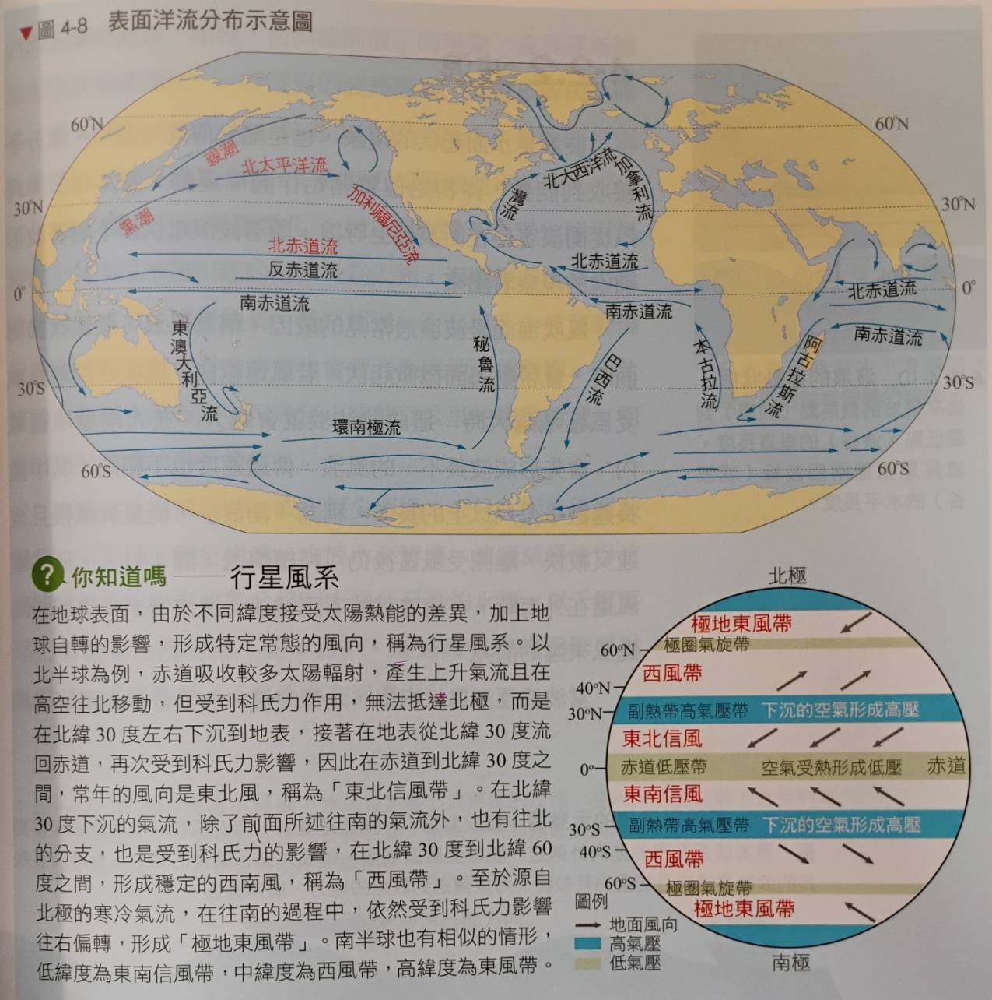
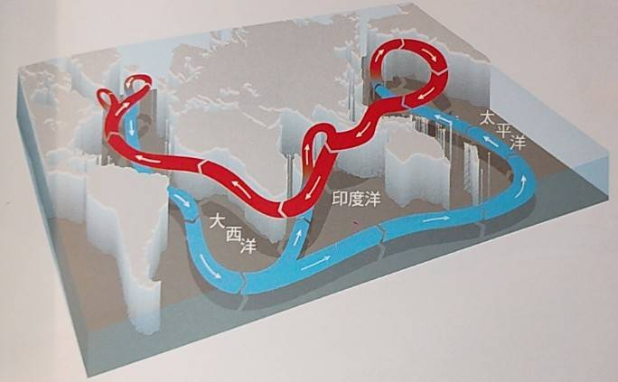

# Ch4 海洋

# 海洋的結構
- ## 海洋的組成
  - 水佔 96.5%, 鹽類佔 3.5% 左右
  - 四大主要離子: $Cl^{-}, Na^{+}, SO_{4}^{2-}, Mg^{2+}$
  - ### 鹽類的影響
    1. 冰點低於 0°C
    2. 比熱 > 1
  - ### 海水的鹽度
    - 海洋數億年來總鹽量收支有平衡
    - #### 使用單位:
      1. 千分比(‰)
        - 利用硝酸銀測定氯離子濃度(產生白色氯化銀沉澱)
        - $AgNO_3 + Cl^{-} -> AgCl(s)\downarrow + NO_{3}^{-}$
      2. 實用鹽度單位(PSU)
        - 利用導電度與鹽度呈正相關的特性測量
  - 註: 全球海洋平均深度為 4km
- ## 海洋的鹽溫分布
  - ### 全域鹽度分布
    - 赤道: (降水 > 蒸發) -> 鹽度偏低
    - 副熱帶: (降水 < 蒸發) -> 鹽度偏高
    - 中緯度: (降水 > 蒸發) -> 鹽度偏低
    - 副極地&極地: 蒸發和降水極少，但是大量融冰造成鹽度更低
  - ### 局部鹽度分布
    - 大陸邊緣: 河川注入海中 -> 鹽度偏低 (所以北半球鹽度較低)
    - 地中海: 蒸發旺盛且半封閉 -> 鹽度偏高(38‰)
    - 南海: 降水強盛 -> 鹽度偏低(32‰)
  - ### 水平溫度分布
    - 等溫線和緯度大致平行，沒什麼特別的
    - 還需考慮: 洋流(暖流...), 湧升流(冷)
  - ### 垂直溫度分布
    - **混合層**
      - 深度不到 200m
      - 低緯度地區較薄(赤道無風帶)
      - 夏季較薄(風速小且熱量集中在表層)
      - 受陽光直射，對流旺盛，溫度均勻
    - **斜溫層**
      - 深度落在 200~800m 之間
      - 夏季時這層特別明顯(溫差大)
      - 介於混合層和深水層間，溫度急遽下降
      - 低緯度地區這一層最為明顯，存在永久性斜溫層
    - **深水層**
      - 深度超過 800m
      - 水溫不到 5°C, 溫度穩定
      - 越往下越接近 1°C (海水密度最大)
    - 註: **混合層與斜溫層幾乎消失**(一樣冷)

# 海水的運動
- ## 海流
  - ### 洋流(表面)
    - 
  - ### 溫鹽環流
    - 
    - 一次循環需要**一千多年**
    - 格陵蘭右下: 海水低溫 + 結冰 -> 鹽度上升
    - 鹽度上升造成海水下降，成為溫鹽環流源頭
    - 經過(印度洋/太平洋)後上升再流回大西洋
