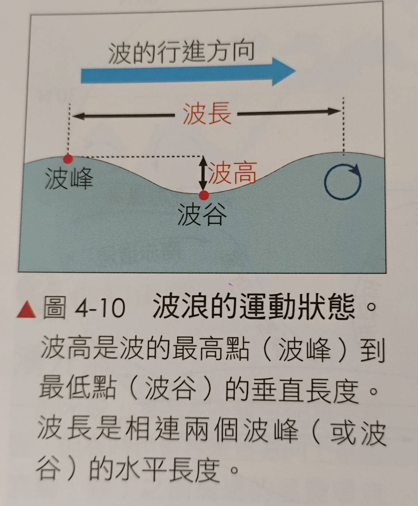
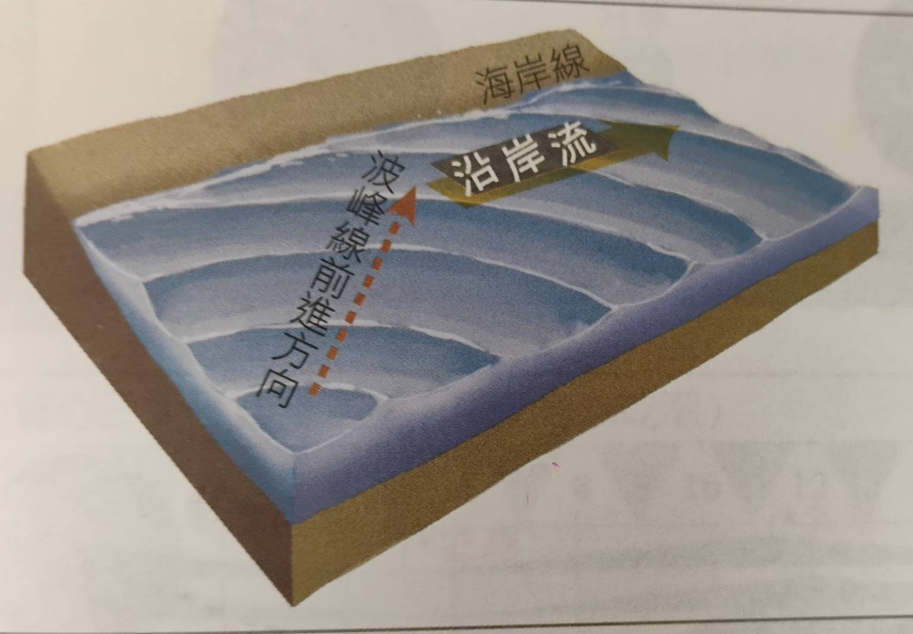
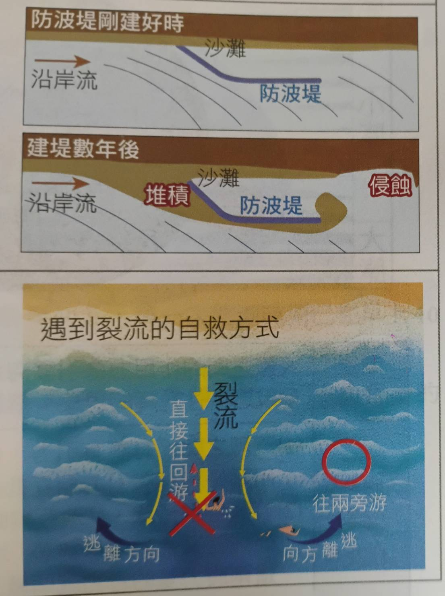
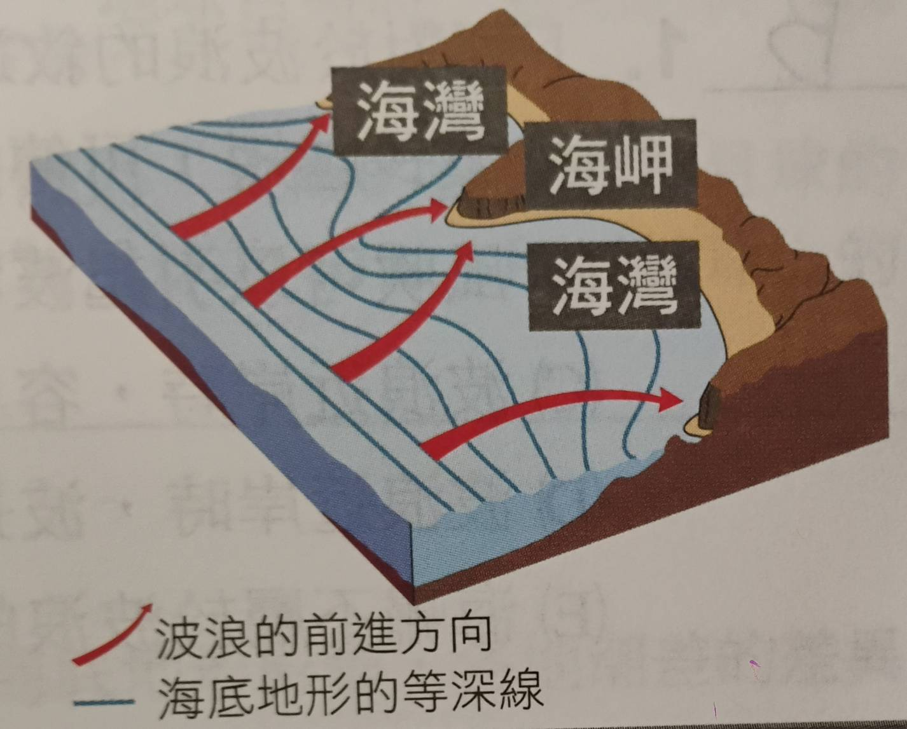
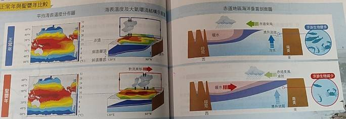
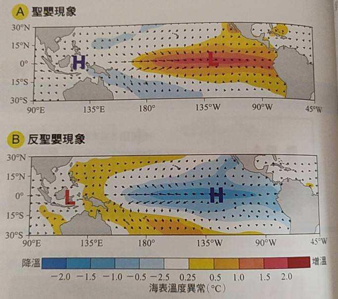

# Ch4 海洋

# 海洋的結構
- ## 海洋的組成
  - 水佔 96.5%, 鹽類佔 3.5% 左右
  - 四大主要離子: $Cl^{-}, Na^{+}, SO_{4}^{2-}, Mg^{2+}$
  - ### 鹽類的影響
    1. 冰點低於 0°C
    2. 比熱 > 1
  - ### 海水的鹽度
    - 海洋數億年來總鹽量收支有平衡
    - #### 使用單位:
      1. 千分比(‰)
        - 利用硝酸銀測定氯離子濃度(產生白色氯化銀沉澱)
        - $AgNO_3 + Cl^{-} -> AgCl(s)\downarrow + NO_{3}^{-}$
      2. 實用鹽度單位(PSU)
        - 利用導電度與鹽度呈正相關的特性測量
  - 註: 全球海洋平均深度為 4km
- ## 海洋的鹽溫分布
  - ### 全域鹽度分布
    - 赤道: (降水 > 蒸發) -> 鹽度偏低
    - 副熱帶: (降水 < 蒸發) -> 鹽度偏高
    - 中緯度: (降水 > 蒸發) -> 鹽度偏低
    - 副極地&極地: 蒸發和降水極少，但是大量融冰造成鹽度更低
  - ### 局部鹽度分布
    - 大陸邊緣: 河川注入海中 -> 鹽度偏低 (所以北半球鹽度較低)
    - 地中海: 蒸發旺盛且半封閉 -> 鹽度偏高(38‰)
    - 南海: 降水強盛 -> 鹽度偏低(32‰)
  - ### 水平溫度分布
    - 等溫線和緯度大致平行，沒什麼特別的
    - 還需考慮: 洋流(暖流...), 湧升流(冷)
  - ### 垂直溫度分布
    - **混合層**
      - 深度不到 200m
      - 低緯度地區較薄(赤道無風帶)
      - 夏季較薄(風速小且熱量集中在表層)
      - 受陽光直射，對流旺盛，溫度均勻
    - **斜溫層**
      - 深度落在 200~800m 之間
      - 夏季時這層特別明顯(溫差大)
      - 介於混合層和深水層間，溫度急遽下降
      - 低緯度地區這一層最為明顯，存在永久性斜溫層
    - **深水層**
      - 深度超過 800m
      - 水溫不到 5°C, 溫度穩定
      - 越往下越接近 1°C (海水密度最大)
    - 註: **混合層與斜溫層幾乎消失**(一樣冷)

# 海水的運動
- ## 海流
  - ### 洋流(表面)
    - 
  - ### 溫鹽環流
    - 
    - 一次循環需要**一千多年**，深度達 2~3 公里
    - 格陵蘭右下: 海水低溫 + 結冰 -> 鹽度上升
    - 鹽度上升造成海水下降，成為溫鹽環流源頭
    - 經過(印度洋/太平洋)後上升再流回大西洋
  - ### 湧升流
    - 定義: 下而上流的洋流
    - **形成原因**
      - 1. 表面海水被風吹走
      - 2. 海流從深海撞上淺灘
    - **特性:**
      - 溫度較低
      - 富有營養鹽
    - 結果: 漁獲量較多
- ## 波浪
  - 
  - ### 風浪
    - 風吹海面所形成
    - 風越大越持久，浪就越大
  - ### 湧浪
    - 定義: 波長達數十公尺以上的長浪
    - 波速較快且能量衰減慢(平常岸邊看到的)
  - ### 當波浪靠近海岸
    - 水深變淺，摩擦力造成波浪減速
    - 後浪追前浪 -> 波長縮短，波高增加
    - 若波高過高hold不住，就會形成碎波
  - 
  - 
  - 
  - 註: 還有海嘯/瘋狗浪...
  - 註: 裂流就是離岸流(沿岸流對撞)

# 大氣與海洋的交互作用
- 
- 
- **聖嬰/反聖嬰/正常年**
- 正常年介於聖嬰和反聖嬰之間
- 三者皆發生於太平洋，發生時間難預測
- **海面溫度**是判斷這些現象的重要依據
- ## 反聖嬰現象
  - ### 形成原因與過程
    - 赤道東風強勁 -> 海水向西側集中
    - 東側海水少 -> 湧升流出現(填補缺口)
    - 湧升流出現 -> 東側海水較冷(稱作冷舌)
    - 湧升流帶來豐富的營養鹽 -> 漁貨量增加
    - 赤道東風吹到西側後抬升 -> 形成低氣壓 -> 降雨/溫度高
    - 西側的對流劇烈 -> 混合層較厚;東側較冷形成高壓 -> 混合層較薄
  - 反聖嬰年: 1988-1989, 1998-2000, 2010-2012, 2020-2023
- ## 聖嬰現象
  - ### 形成原因與過程
    - 赤道東風減弱 -> 原本堆積在西側的暖海水向東回流
    - 東側海水增多 -> 湧升流受到抑制
    - 湧升流減弱 -> 東側海水異常升溫
    - 冷舌消失，暖水範圍擴大 -> 營養鹽輸送中斷
    - 底層營養物質無法到達表層 -> 漁獲量大幅減少
    - 對流中心東移 -> 原本在西側的抬升區向東移動 -> 形成低氣壓 -> 南美沿岸降雨激增
    - 西側對流熄火 -> 西側轉為下沉氣流形成高壓 -> 混合層變薄;東側因暖水堆積 -> 混合層變厚
  - 聖嬰年: 1982-1983, 1997-1998
