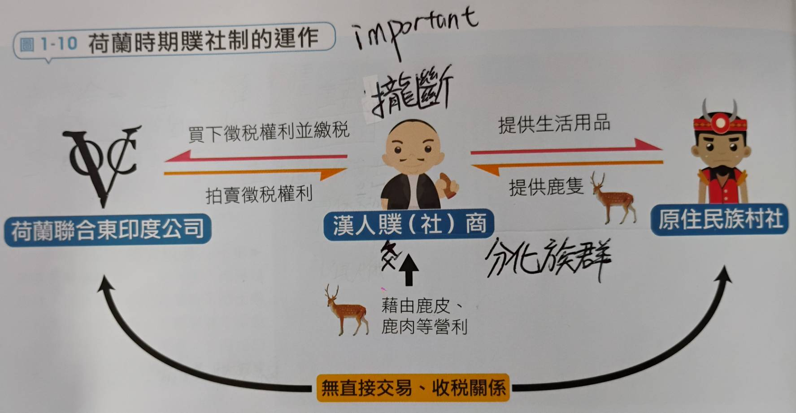
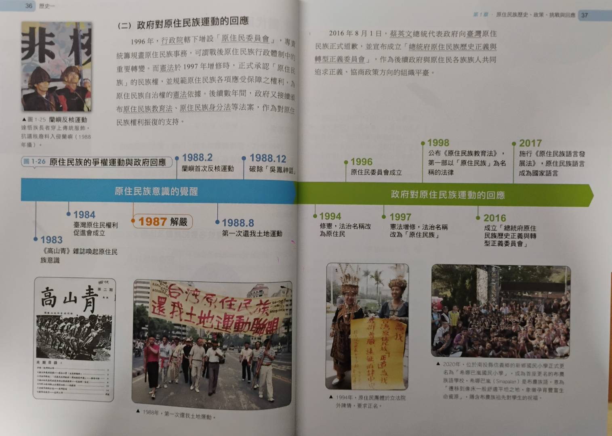

# 原住民族政策的變遷
- ## 荷西時期
  - **背景**: 荷蘭80年戰爭脫離西班牙統治
  - **過程**: 轉口貿易，中國/日本政府集權
  - **結果**: 分而治之，共構殖民
  - 將行政權交給地方長老(代為管理)
  - 實行**贌社制**，將徵稅權以競標的形式賣出
- 
- ## 鄭氏時期
  - 沿用贌社制(直到1737乾隆時期)
  - **屯兵籌糧**，壓縮原住民生存空間
  - 中部大肚番王(沙轆社)幾乎被鄭軍全滅
  - 遴選平埔族"土官"約束和管理部落(清朝沿用)
- ## 清領時期
  - ### 清領前期
    - **生番化熟，熟番化漢**
    - 朱一貴事件前就**劃界封山**
    - 大甲西社事件->岸裡社**以番制番**
  - ### 沈葆楨時期
    - 1867年**羅妹號事件**發生
    - 美國駐廈門領事"李仙得"否定番地屬於清帝國
    - 李仙得建議明治天皇攻台->1871牡丹社事件
    - 琉球船民在恆春半島遇害，日以"保民義舉"為由攻台
    - 沈葆楨**開山撫番**，其中開山是目的;撫番是手段
  - ### 劉銘傳時期
    - 發生大嵙崁事件
    - 繼續**開山撫番**，並設立番學堂漢化原住民
    - 此時的**撫番**即是以武力征討不服統治的原住民
  - 原漢衝突更嚴重，原住民族漢化
- ## 日治時期
  - 恩威並施，開發番地，謀取山林資源
  - ### 開發山地的原因
    - **國際市場**
      - 歐戰火藥需求(1890s)
      - 越戰農業補給(1960s)
    - **山林可視化**
      - 發展新產業
      - 防範匪徒隱匿
    - **人口壓力**
      - 安置漢人/日本移民/外省老兵
  - ### 實際上的作為
    - 南庄事件後建立專勤警察制度，加強隘勇線
    - 總督提出"五年理蕃計畫(1910-1915)"
    - 設置蕃童教育所，普及日語，警察兼教師
    - 原住民反抗->實施集團移住->分化族群
    - 高壓統治->發生霧社事件(1930)->總督下台
    - 皇民化運動，強化國民意識
    - 二戰時開始軍事動員，組成高砂義勇隊
- ## 國民政府
  - ### 解嚴前
    - 韓戰(1960s)後農業經濟無法維持生計
    - 實現山地平地化，加強國家認同->山地同胞
  - 原住民族主要在後受保障
  - ### 解嚴後
  - 成立台灣原住民權利促進會/原住民族委員會
  - 提出正名權/土地權/文化權/自治權，改名為原住民
- 
