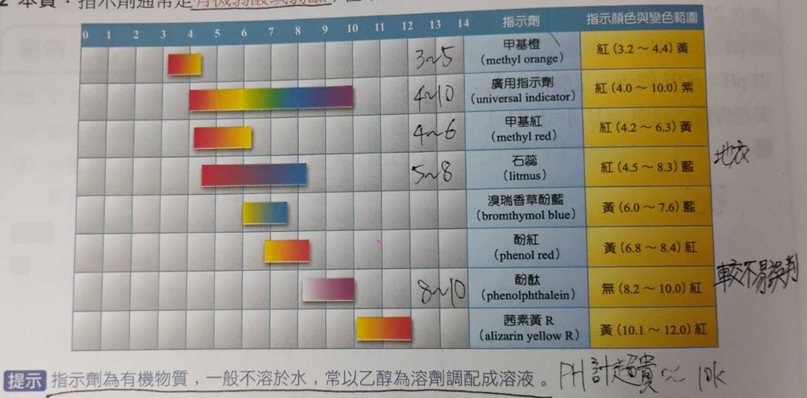
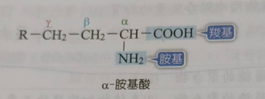
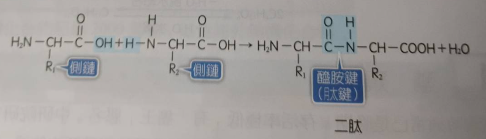
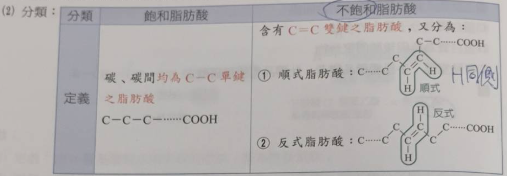
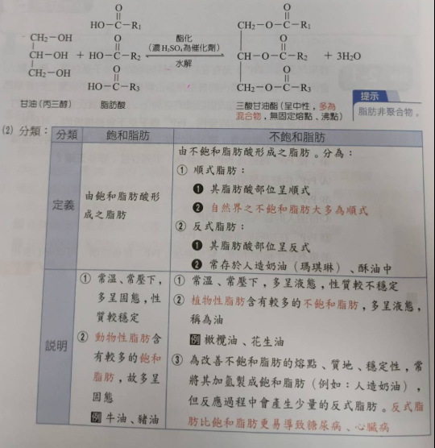

# 3-2 溶解度
- ## 溫度的影響
  - 大部分固體 溶解吸熱 高溫時溶解度高
  - 大部分氣體 溶解放熱 低溫時溶解度高
  - 液體通常溶解吸熱(比較不討論)或者完全互溶
  - **特例**: 
    - NaCl(溶解度幾乎恆定)
    - $(X)SO_{4}(硫酸鹽類)$     (溶解放熱 低溫時溶解度高)
    - $CaCl_{2}(氯化鈣)$/強酸鹼 (溶解放熱 低溫時溶解度高)

# 3-3 酸鹼反應
- ## 金屬活性大小
  - ### keyword
    - 標準電極電勢
    - 標準電極電位
    - 標準還原電位
  - 測量標準: (25°C, 1atm)
  - 數據並非最精準/最新，但是夠用了(包括和...才會反應)
  - define: $2H^{+}+2e^{-} \rightarrow H_{2}$ &nbsp;&nbsp;E°=0.0V
  - ### 標準電極電位表
| 半反應 | E°(V) |
|---|---|
| $\text{Li}^+ + \text{e}^- \rightleftharpoons \text{Li}$ | -3.06 |
| $\text{K}^+ + \text{e}^- \rightleftharpoons \text{K}$ | -2.92 |
| $\text{Cs}^+ + \text{e}^- \rightleftharpoons \text{Cs}$ | -2.92 |
| $\text{Ba}^{2+} + \text{2e}^- \rightleftharpoons \text{Ba}$ | -2.90 |
| $\text{Ca}^{2+} + \text{2e}^- \rightleftharpoons \text{Ca}$ | -2.76 |
| $\text{Na}^+ + \text{e}^- \rightleftharpoons \text{Na}$ | -2.7109 |
| $\text{Mg}^{2+} + \text{2e}^- \rightleftharpoons \text{Mg}$ | -2.38 |
| $\text{Al}^{3+} + \text{3e}^- \rightleftharpoons \text{Al}$ (0.1 M NaOH) | -1.71 |
| $\text{Mn}^{2+} + \text{2e}^- \rightleftharpoons \text{Mn}$ | -1.19 |
| $\text{Zn}^{2+} + \text{2e}^- \rightleftharpoons \text{Zn}$ | -0.76 |
| $\text{Cr}^{3+} + \text{3e}^- \rightleftharpoons \text{Cr}$ | -0.74 |
| $\text{Fe}^{2+} + \text{2e}^- \rightleftharpoons \text{Fe}$ | -0.41 |
| $\text{Co}^{2+} + \text{2e}^- \rightleftharpoons \text{Co}$ | -0.28 |
| $\text{Ni}^{2+} + \text{2e}^- \rightleftharpoons \text{Ni}$ | -0.23 |
| $\text{Sn}^{2+} + \text{2e}^- \rightleftharpoons \text{Sn}$ | -0.14 |
| $\text{Pb}^{2+} + \text{2e}^- \rightleftharpoons \text{Pb}$ | -0.13 |
| $\text{Fe}^{3+} + \text{3e}^- \rightleftharpoons \text{Fe}$ | -0.04 |
| $\text{2H}^+ + \text{2e}^- \rightleftharpoons \text{H}_2$ | 0 |
| $\text{Cu}^{2+} + \text{2e}^- \rightleftharpoons \text{Cu}$ | 0.34 |
| $\text{Ag}^+ + \text{e}^- \rightleftharpoons \text{Ag}$ | 0.80 |
| $\text{Hg}^{2+} + \text{2e}^- \rightleftharpoons \text{Hg}$ | 0.85 |
| $\text{Pt}^{2+} + \text{2e}^- \rightleftharpoons \text{Pt}$ | 1.20 |
| $\text{Au}^{3+} + \text{3e}^- \rightleftharpoons \text{Au}$ | 1.42 |
- ### 實際反應程度
  - **加冷水**
    - $\text{Li, Rb, K, Cs, Ba, Ca, Na}$
  - **加熱水/水蒸氣**
    - $\text{Mg, Al}$
  - **加稀酸($HCl, H_2SO_4$)**
    - $\text{Mn, Zn, Cr, Fe, Co, Ni, Sn, Pb}$
  - **加強氧化性酸(硝酸/濃硫酸)**
    - $\text{Cu, Ag, Hg}$
    - 如果是硫酸還要加熱，n為金屬的氧化數
    - 和稀硝酸反應式: $3M + 2n\,HNO_3 \rightarrow 3M(NO_3)_n + 2NO \uparrow + n\,H_2O$
    - 和濃硝酸反應式: $M + 2n\,HNO_3 \rightarrow M(NO_3)_n + n\,NO_2 \uparrow + n\,H_2O$
    - 和濃硫酸反應式: $2M + 2n\,H_2SO_4 \xrightarrow{\Delta} M_2(SO_4)_n + n\,SO_2 \uparrow + 2n\,H_2O$
  - **加王水($3HCl:1HNO_3$)**
    - $\text{Pt, Au}$ ($產生AgCl_{4}^{-}...$)
- ### 阿瑞尼斯酸鹼
  - 僅限於水溶液中
  - \[$H^+$\], \[$OH^-$\]
  - 強酸鹼: 幾乎完全解離
  - 弱酸鹼: 僅部分解離
  - 酸+鹼 -> 鹽+水 + 熱量
  - 強酸: $HClO_4(過氯酸) > HI(氫碘酸) > HBr(氫溴酸) > HCl(鹽酸) > HNO_3(硝酸) > H_2SO_4(硫酸) > H_3O^{+}(水合氫離子/鋞離子)$
  - 強鹼: 第一族元素以及Ca/Sr/Ba的氫氧化物，鋰和氫除外
  - 其他特殊鹼(搶走$H^+$):
    - 1. $NH_3 + H_2O \rightarrow NH_{4}^{+} + OH^{-}$
    - 2. $CO_{3}^{2-} + H^{+} \rightarrow HCO_{3}^{-}$
    - 3. $HCO_{3}^{-} + H_2O \rightarrow H_2CO_3 + OH^{-}$    (反應較強)
    - 3. $HCO_{3}^{-} + H_2O \rightarrow CO_3^{2+} + H_3O^{+}$(反應較弱)
- ### 路易士酸鹼
  - 酸(Acid): 有空軌域
  - 鹼(Base): 有孤對$e^-$
- ### 酸鹼指示劑
  - 本身通常是有機酸/弱鹼
  - 

# 3-4 氧化還原反應
- 物質帶的電為**氧化數**
- **氧化**: 失去電子，氧化數 $\uparrow$
- **還原**: 得到電子，氧化數 $\downarrow$
- **常見氧化劑**
  - $O_2, O_3, H_2O_2, Cl_2, KMnO_4, K_2Cr_2O_7, 漂白水$
- **常見還原劑**
  - $C,H_2,SO_2,NaHSO_3$,維生素C&E

# 4-1 常見有機物質
- 加熱氰酸氨($NH_4OCN$) 可得尿素
- ## 醣類
  - ### 單醣
    - $核糖(C_5H_10O_5),去氧核糖(C_5H_10O_5)$
    - 葡萄糖/果糖/半乳糖($C_6H_{12}O_6$)
  - ### 雙醣
    - $C_{12}H_{22}O_{11}$
    - **麥芽糖:** 葡萄糖 + 葡萄糖  
    - **蔗糖  :** 葡萄糖 + 果糖
    - **乳糖  :** 葡萄糖 + 半乳糖
  - ### 寡醣
    - 3~9個單醣聚合而成
  - ### 多醣
    - **澱粉**:
      - 碘液: $I_2, KI$ (會產生紅棕色$I_{3}^{-}$)
      - 檢測: $澱粉 + I_{3}^{-} \rightarrow 變藍黑色$
    - **肝醣**
    - **纖維素**
    - **幾丁質**
      - 含氮，結構類似纖維，又稱甲殼素
- ## 蛋白質
  - ### 胺基酸
    - 含有 $COOH,NH_2$ 的有機化合物
    - 以下為 $\alpha 胺基酸$ (其中一種)
    - 
  - ### 胜肽
    - 兩個胺基酸脫水聚合而成，鍵結稱為肽鍵(醯胺鍵)
    - 脫去 $COOH的OH以及NH_2上的H$
    - 有"二肽", "三肽", "多肽"
    - 
  - ### 蛋白質
    - 由多個 $\alpha 胺基酸$ 聚合而成
    - 分子量 >= 胰島素(5808)的多肽
    - 遇到高溫/PH值改變... 會變性
    - 檢驗: 和濃硝酸加熱反應後會變黃色(蛋白黃反應)
- ## 油脂
  - ### 脂肪酸
    - 為直鏈的R-COOH，常見16/18個碳者
    - 
  - ### 脂肪
    - 脂肪並非聚合物
    - 最小單位為三酸甘油酯
    - 3脂肪酸 + 1甘油分子
    - 

# 4-2
- ## 常用藥品
  - ### 鎮痛解熱劑
    - 
  - ### 抗生素
    - **盤尼西林(青黴素)**
      - 為人類(弗萊明)發現的第一個抗生素
    - **路鄧素**
      - 可抑制金黃色葡萄球菌生長，據環肽結構
  - ### 制酸劑
    - $Al(OH)_3, Mg(OH)_2, NaHCO_3, CaCO_3, MgCO_3$
    - 帶有 $CO_3$ 者容易脹氣(遇胃酸產生 $CO_2$)
    - 帶有Al者容易便秘；帶有Mg者容易腹瀉
- ## 奈米材料
  - 長寬高至少有一個落在1~100nm之間
  - 物性/化性都差很多，表面活性明顯
  - ### 二氧化鈦
    - 受紫外光照時 $TiO_2$ 的電子從價電帶跳到導電帶
    - 產生超氧陰離子 $(·O_{2}^{-})$ 和氫氧自由基 $(·OH)$
  - ### 奈米銀
    - 釋出銀離子(抗菌)
  - ### 奈米碳管
    - 由石墨烯捲曲成，為自然界最細的管子
    - 質量輕/彈性佳/強度高/化性穩定/有些可導電
- ## 水的淨化
  - ### 自來水
    - 明礬產生膠體 $Al(OH)_3$ 吸附微粒沉澱
    - 打入空氣增加溶氧量，讓微生物分解有機物
    - 臭氧殺菌(成本高) or 氯氣殺菌(便宜)
    - $Cl_2+H_2O \rightarrow HCl+HClO$
    - 氯氣殺菌會產生三氯甲烷(致癌)，需煮沸去除
  - ### 海水淡化
    - U型管+半透膜，海水端加壓
  - ### 硬水軟化
    - **軟水**: 不含有 $Ca^{2+}, Mg^{2+}$
    - **暫時硬水**: 含 $(Ca/Mg)(HCO_3)_2$
    - **永久硬水**: 含 $(Ca/Mg)(SO_4/Cl_2)$
    - 硬水會使肥皂失去效果(和離子反映後沉澱)
    - 暫時硬水加熱後會沉澱產生鍋垢( $(Ca/Mg)(CO_3)$ )
    - 蘇打/天然泡沸石/陽離子交換樹脂可以吸收鈣鎂離子(沉澱)
    - 樹脂: 通式為NaZ，鈣鎂離子飽和後可用飽和NaCl沖洗"再生"

> 原子經濟 = $\frac{目標}{原料} \times 100%$  
> 肥皂親水端為 $COO^-$；清潔劑為 $OSO_3^-$
> 肥皂常見18酸鈉；清潔劑常見12烷基硫酸鈉
> $羧基COOH, 胺基NH_2, 羥基OH$  
> 重金屬離子用強鹼去除  
> 酸鹼加合物  
> 配位共價鍵  
> 共用軌域  
