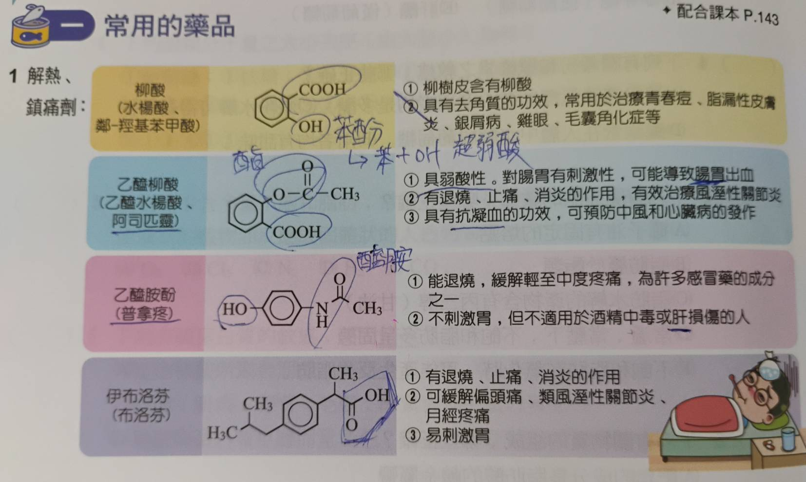
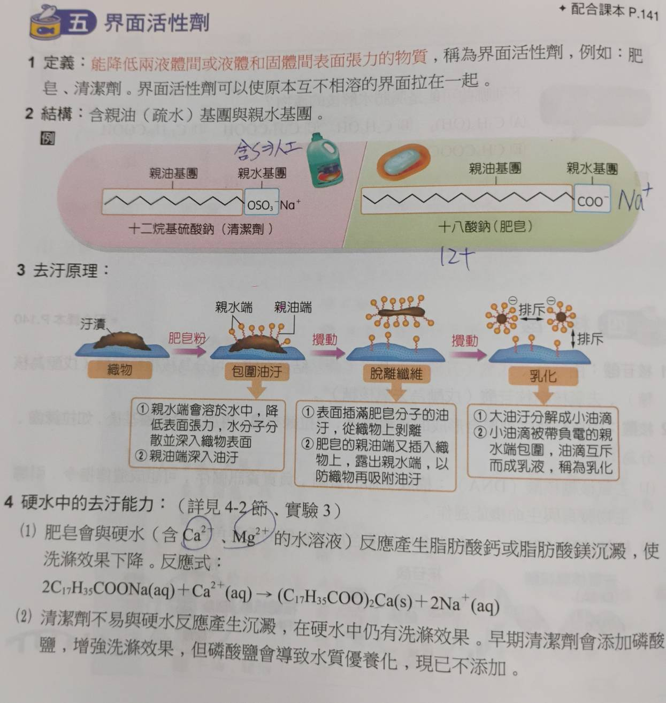
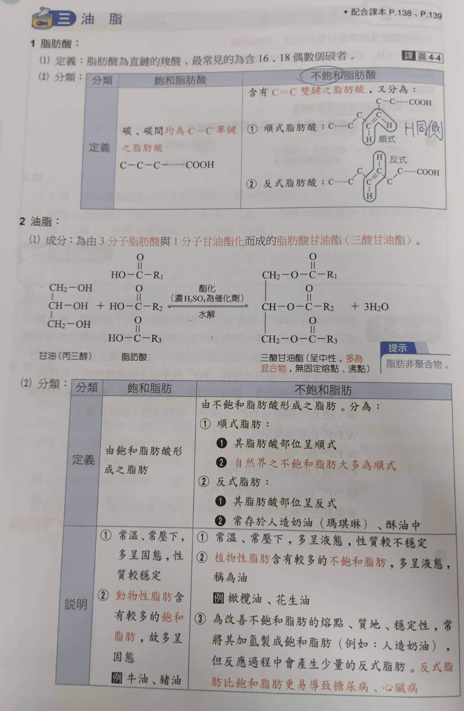
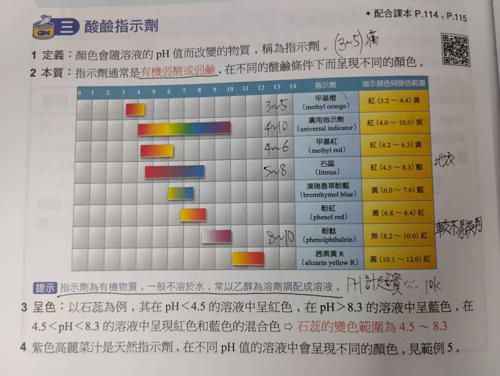
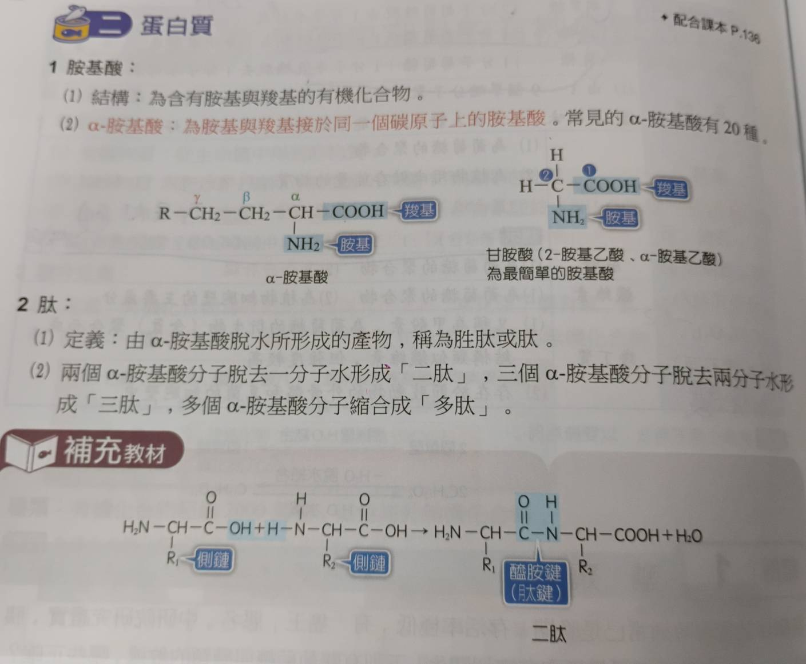

# 3-2 溶解度
- ## 溫度的影響
  - 大部分固體 溶解吸熱 高溫時溶解度高
  - 大部分氣體 溶解放熱 低溫時溶解度高
  - 液體通常溶解吸熱(比較不討論)或者完全互溶
  - **特例**: 
    - NaCl(溶解度幾乎恆定)
    - $(X)SO_{4}(硫酸鹽類)$     (溶解放熱 低溫時溶解度高)
    - $CaCl_{2}(氯化鈣)$/強酸鹼 (溶解放熱 低溫時溶解度高)

# 3-3 酸鹼反應
- ## 金屬活性大小
  - ### keyword
    - 標準電極電勢
    - 標準電極電位
    - 標準還原電位
  - 測量標準: (25°C, 1atm)
  - 數據並非最精準/最新，但是夠用了(包括和...才會反應)
  - define: $2H^{+}+2e^{-} \rightarrow H_{2}$ &nbsp;&nbsp;E°=0.0V
  - ### 標準電極電位表
| 半反應 | E°(V) |
|---|---|
| $\text{Li}^+ + \text{e}^- \rightleftharpoons \text{Li}$ | -3.06 |
| $\text{K}^+ + \text{e}^- \rightleftharpoons \text{K}$ | -2.92 |
| $\text{Cs}^+ + \text{e}^- \rightleftharpoons \text{Cs}$ | -2.92 |
| $\text{Ba}^{2+} + \text{2e}^- \rightleftharpoons \text{Ba}$ | -2.90 |
| $\text{Ca}^{2+} + \text{2e}^- \rightleftharpoons \text{Ca}$ | -2.76 |
| $\text{Na}^+ + \text{e}^- \rightleftharpoons \text{Na}$ | -2.7109 |
| $\text{Mg}^{2+} + \text{2e}^- \rightleftharpoons \text{Mg}$ | -2.38 |
| $\text{Al}^{3+} + \text{3e}^- \rightleftharpoons \text{Al}$ (0.1 M NaOH) | -1.71 |
| $\text{Mn}^{2+} + \text{2e}^- \rightleftharpoons \text{Mn}$ | -1.19 |
| $\text{Zn}^{2+} + \text{2e}^- \rightleftharpoons \text{Zn}$ | -0.76 |
| $\text{Cr}^{3+} + \text{3e}^- \rightleftharpoons \text{Cr}$ | -0.74 |
| $\text{Fe}^{2+} + \text{2e}^- \rightleftharpoons \text{Fe}$ | -0.41 |
| $\text{Co}^{2+} + \text{2e}^- \rightleftharpoons \text{Co}$ | -0.28 |
| $\text{Ni}^{2+} + \text{2e}^- \rightleftharpoons \text{Ni}$ | -0.23 |
| $\text{Sn}^{2+} + \text{2e}^- \rightleftharpoons \text{Sn}$ | -0.14 |
| $\text{Pb}^{2+} + \text{2e}^- \rightleftharpoons \text{Pb}$ | -0.13 |
| $\text{Fe}^{3+} + \text{3e}^- \rightleftharpoons \text{Fe}$ | -0.04 |
| $\text{2H}^+ + \text{2e}^- \rightleftharpoons \text{H}_2$ | 0 |
| $\text{Cu}^{2+} + \text{2e}^- \rightleftharpoons \text{Cu}$ | 0.34 |
| $\text{Ag}^+ + \text{e}^- \rightleftharpoons \text{Ag}$ | 0.80 |
| $\text{Hg}^{2+} + \text{2e}^- \rightleftharpoons \text{Hg}$ | 0.85 |
| $\text{Pt}^{2+} + \text{2e}^- \rightleftharpoons \text{Pt}$ | 1.20 |
| $\text{Au}^{3+} + \text{3e}^- \rightleftharpoons \text{Au}$ | 1.42 |
- ### 實際反應程度
  - **加冷水**
    - $\text{Li, Rb, K, Cs, Ba, Ca, Na}$
  - **加熱水/水蒸氣**
    - $\text{Mg, Al}$
  - **加稀酸($HCl, H_2SO_4$)**
    - $\text{Mn, Zn, Cr, Fe, Co, Ni, Sn, Pb}$
  - **加強氧化性酸(硝酸/濃硫酸)**
    - $\text{Cu, Ag, Hg}$
    - 如果是硫酸還要加熱，n為金屬的氧化數
    - 和稀硝酸反應式: $3M + 2n\,HNO_3 \rightarrow 3M(NO_3)_n + 2NO \uparrow + n\,H_2O$
    - 和濃硝酸反應式: $M + 2n\,HNO_3 \rightarrow M(NO_3)_n + n\,NO_2 \uparrow + n\,H_2O$
    - 和濃硫酸反應式: $2M + 2n\,H_2SO_4 \xrightarrow{\Delta} M_2(SO_4)_n + n\,SO_2 \uparrow + 2n\,H_2O$
  - **加王水($3HCl:1HNO_3$)**
    - $\text{Pt, Au}$ ($產生AgCl_{4}^{-}...$)
- ### 阿瑞尼斯酸鹼
  - 僅限於水溶液中
  - \[$H^+$\], \[$OH^-$\]
  - 強酸鹼: 幾乎完全解離
  - 弱酸鹼: 僅部分解離
  - 酸+鹼 -> 鹽+水 + 熱量
  - 強酸: $HClO_4(過氯酸) > HI(氫碘酸) > HBr(氫溴酸) > HCl(鹽酸) > HNO_3(硝酸) > H_2SO_4(硫酸) > H_3O^{+}(水合氫離子/鋞離子)$
  - 強鹼: 第一族元素以及Ca/Sr/Ba的氫氧化物，鋰和氫除外
  - 其他特殊鹼(搶走$H^+$):
    - 1. $NH_3 + H_2O \rightarrow NH_{4}^{+} + OH^{-}$
    - 2. $CO_{3}^{2-} + H^{+} \rightarrow HCO_{3}^{-}$
    - 3. $HCO_{3}^{-} + H_2O \rightarrow H_2CO_3 + OH^{-}$    (反應較強)
    - 3. $HCO_{3}^{-} + H_2O \rightarrow CO_3^{2+} + H_3O^{+}$(反應較弱)
- ### 路易士酸鹼
  - 酸(Acid): 有空軌域
  - 鹼(Base): 有孤對$e^-$

# 3-4 氧化還原反應
- **氧化**: 失去電子
- **還原**: 得到電子
- **常見氧化劑**
  - $O_2, O_3, H_2O_2, Cl_2, KMnO_4, K_2Cr_2O_7, 漂白水$
- **常見還原劑**
  - $C,H_2,SO_2,NaHSO_3$,維生素C&E

> 寡糖3~9個碳  
> 蔗糖  : 果糖  
> 乳糖  : 半乳糖
> 麥芽糖: 葡萄糖  
> 蛋白質最小分子量5808(胰島素)  
> 蛋白質遇到濃硝酸 -> 蛋白黃反應
> 酸鹼加合物  
> 配位共價鍵  
> 共用軌域  

