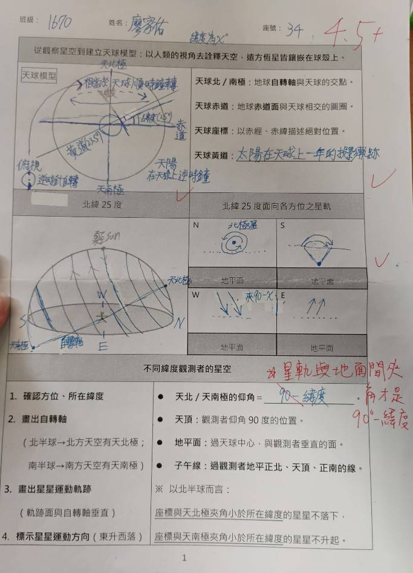
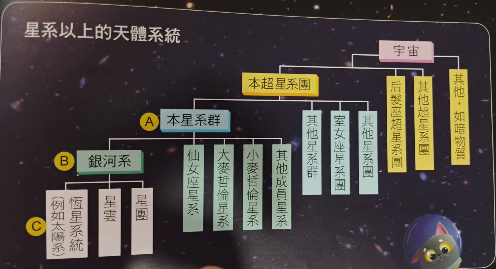
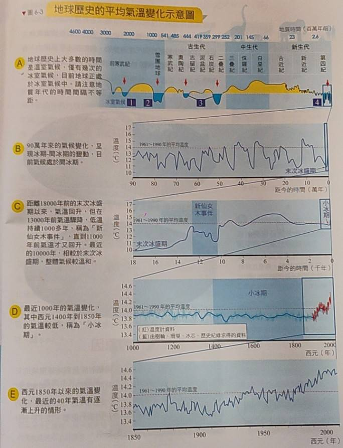
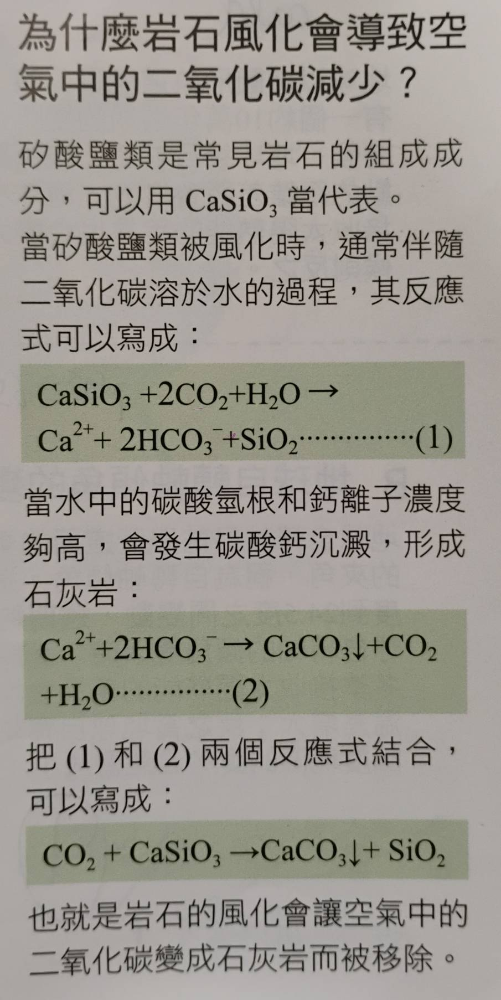
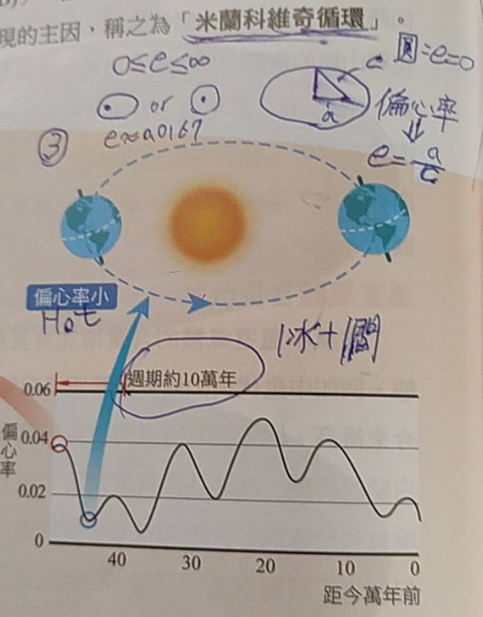
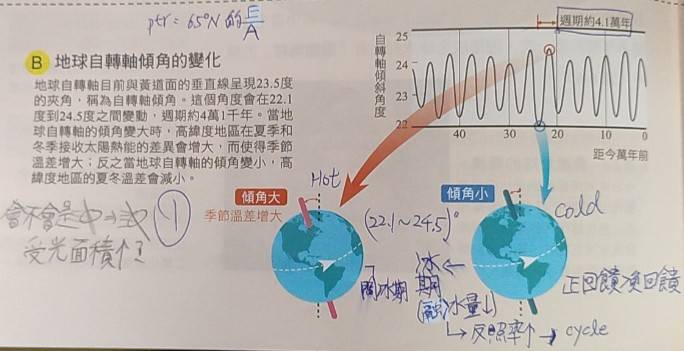
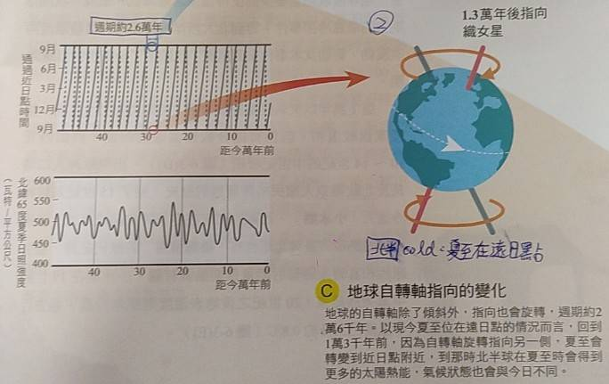

# 太陽系
- ## 分類
  - **恆星**: 
    - 太陽(自行核融合發光發熱)
  - **行星**: 
    - 環繞恆星運轉
    - 能清除軌道上的物質
    - 重力達流體靜力平衡(球形)
  - **矮行星**:
    - 環繞恆星運轉
    - 重力達流體靜力平衡(球形)
  - **太陽系小天體**:
    - Any other substance
- ## 由內而外
  - ### 太陽
    - 半徑約 1400k 公里
    - 太陽系半徑約 1.5 光年
    - 距離最近的恆星-半人馬座 $\alpha$ 星C約 4.2 光年
  - ### 水金地火
    - 為類地行星
    - 自轉較慢/磁場微弱
    - 旋轉半徑: (0.4~1.5)AU
  - ### 小行星帶
    - 除了榖神星以外接是太陽系小天體
    - 旋轉半徑: 約(2~2.5)AU
  - ### 木土天海
    - 為類木行星
    - 皆有行星環
    - 自轉較快/磁場較強
    - 旋轉半徑: (5.2~30)AU
  - ### 古柏帶
    - 又稱柯伊伯帶
    - 一樣是在黃道面上
    - 包含冥王星等矮行星
    - 擁有大量短周期彗星(<200年)
    - 旋轉半徑: (30~50)AU
  - ### 歐特雲
    - 呈球狀，為太陽的引力影響範圍邊界
    - 冰冷/遙遠/原始/無法直接觀測
    - 擁有大量長周期彗星(>200年)
    - 旋轉半徑: (50~5k)AU
  - ### 太陽風
    - 成分為高能帶電粒子(0.5~10keV)
    - 由日冕出發，移動速度極快(數百km/s)
    - 質子(95%)、α粒子(4%)、自由電子(維持電中性)
    - 影響範圍: 到日球層頂(和周圍恆星風強度一致)
    - 越過磁場碰撞到大氣中的 $N_2$ 時產生激發輻射(極光)
- ## 彗星
  - ### 慧核
    - 直徑通常不超過40km
    - 由冰(冰凍的揮發性氣體)、岩石、塵埃組成
    - 如同一顆髒雪球，冰在內，其他物質在外
    - 高孔隙率，低密度，導熱性極差(多孔隙)
    - 不是球型，反照率比木炭還低(冰在內)
  - ### 慧髮
    - 直徑約落在 100k~1000k 之間
    - 包覆在慧核外側，由揮發的冰和塵埃組成
    - 由於導熱性極差，太陽照射慧核至冰昇華後從孔隙噴出
    - 越靠近慧核密度越大(劇烈碰撞)
  - ### 塵埃尾
    - 寬度很寬，長度不及離子尾
    - 噴出來的微小塵埃(微米)受光壓影響行成
    - 光壓(光子動量) > 引力 -> 背離太陽
    - 角動量守恆 -> 距離太陽越遠，速度越慢
    - 因此距離較遠的塵埃像是落後一般呈曲線
  - ### 離子尾
    - 長度極長，特別是接近太陽時
    - 主要成分: $CO^+(藍色), N_2^+, CO_2^+$
    - 紫外線將氣體分子的電子打出來，形成陽離子
    - 帶電粒子受太陽風影響，筆直背離太陽

# 天球模型
- 

# 星等與亮度
- ### 光度(L)
  - 物體每秒釋放出的能量(J/s or W)
- ### 視亮度(B)
  - 一平方公尺中每秒通過的能量(W/m^2)
  - $B = \frac{L}{4 \pi d^2}$
- ### 視星等(m)
  - $m = -2.5log(\frac{B}{B_織女星})$
  - 定義**織女星=0**，相差5等星則亮度相差100倍
  - 人眼感知的亮度和實際能量成對數關係，因此發明視星等
  - 相差一星等則亮度相差 $sqrt[5]{100} \approx 2.512$ 倍
  - 太陽(-26.8), 滿月(-12.9), 北極星(2.0)
  - 人眼最多看到6等星
- ### 絕對星等(M)
  - 距離該恆星32.6光年(10秒差距)觀測時的視星等
  - **秒差距(距離單位)**:
    - arc-second/arc-minute/degree
    - $1角秒 = \frac{1}{60}角分 = \frac{1}{3600}°$
    - 秒差距(pc)的定義:
      - $1pc*sin(1角秒) = 1AU$
      - $1pc = \frac{1AU}{sin(1角秒)}$

# 宇宙與時空
- 
- [0.0]  大霹靂
- [380k] 3K宇宙微波背景輻射誕生
- [4e]   恆星誕生
- [138e] now
- **宇宙微波背景輻射**:
  - 原本3000K發出的光受電子干擾
  - 一團亂的光遍布宇宙，紅移至約3K
- **宇宙膨脹**
  - $V=H_{0}d$
  - d: 星系距離
  - V: 星系遠離速度
  - $H_0$: 哈伯常數
  - 拿數據湊出的公式

# 時間計算
- 每天地球自轉360度 -> **4分鐘自轉1度**  
- 公轉約一天1度 -> 兩天日出差4分鐘  
- 公轉和自轉方向相同 -> **23hr+56min**  
- 太陽系除了金星順時針自轉外，皆為逆時針  
- 大潮: 日地月成一直線；小潮: 夾90度角  
- 月球公轉360度: 27.3天  
- 月曆變化週期: 29.5天  
- ### 推導
  - 地球公轉1天角速度 = 360/365.25  
  - 角速度大約 0.98 度/天  
  - 月球公轉1天角速度 = 360/29.5  
  - 角速度大約 12.2 度/天  
  - 月球相對於恆星的角速度 = 12.2 + 0.98  
  - 360度/月球公轉週期 = 0.98 + 12.2, 大約 13.2 度/天  
  - 月球公轉週期 = 360/13.2 = 27.2727... 大約 27.3 天  
- ### **潮汐**:   
  - 13.2 度 * 4 分鐘/度 = 52.8 分鐘  
  - 一天漲退潮兩次，間隔 24hr+52.8分鐘  
  - verb: 漲潮/退潮 noun: 滿潮/乾潮  
  - **月引潮力**:   
    - 方向: 背對月球和地球的共同質心
    - 和月球質量呈正比，和距離的三次方呈反比  
  - 日引潮力 : 月引潮力 = 1 : 2  
- ### 觀星
  - 每天星星會提早 4min 來報到  
  - **太陽日**: 兩天太陽在頭頂間隔 = 24hr  
  - **恆星日**: 地球實際自轉360度 = 23hr+56min  

# 地球氣候
- ## 分類
  - **溫室氣候**
    - 地表沒有冰
  - **冰室氣候**
    - **冰期**
    - **間冰期**
    - T = 100k years
  - T = 1~100m years
  - 
- ## 改變氣溫的因素
    - 1. ### 海陸分布
      - 暖流消失 $\rightarrow$ T $\downarrow$
      - 極區有大陸 $\rightarrow$ 累積冰 $\rightarrow$ 反照率 $\uparrow$ $\rightarrow$ T $\downarrow$
    - 2. ### 造山運動
      - 
      - 迎風面降雨 $\rightarrow$ 岩石風化 $\rightarrow$ 矽酸鹽類和 $CO_2$ 反應 $\rightarrow$ 溫室氣體減少 $\rightarrow$ T $\downarrow$
    - 3. ### 火山活動
      - 短期: 產生火山灰 $\rightarrow$ 反照率 $\uparrow$ $\rightarrow$ T $\downarrow$
      - 長期: 產生溫室氣體 $\rightarrow$ T $\uparrow$
- ## 米蘭科維奇循環
  - 
  - 
  - 
- ## 新仙女木事件
  - 地層中發現大量仙女木屬的植物花粉
  - 13000年前出現持續接近1000年的低溫
  - 由極區往赤道冷下來，證實溫鹽環流中止
  - 大量淡水注入北大西洋，海表鹽度降低 -> 溫鹽環流無法下沉
  - 溫鹽環流中止 -> 低緯度暖流無法北上 -> 冰原擴張 -> 反照率 $\uparrow$ -> T $\downarrow$
- ## 有孔蟲與氧同位素比例
  - 令氧同位素比例 ratio = $\frac{O^18}{O^16}$
  - 在岩芯中可以透過測量有孔蟲中 ratio 得知溫度變化
  - $O^{18}形成的重水偏好液態；O^{16}形成的輕水偏好氣態$
  - 水氣與水循環: 水蒸氣向極區移動
  - ### 在冰芯(或大氣/陸地)之中
    - 重水還沒到極區就凝結了
    - 剩下的輕水造成冰芯 ratio 降低
    - ratio 以及溫度都較低 -> $ratio \propto T$
  - ### 在海洋沉積物的岩芯之中
    - 天氣冷時，輕水都跑到極區凝了
    - 海洋之中剩下一堆重水  -> ratio $\uparrow$
    - ratio 較高，溫度較低 -> $ratio \propto \frac{1}{T}$

> 米蘭科維奇循環ABC共同造就冰期與間冰期的循環?  
> 溫鹽環流那麼慢，不是隨便擾動就影響更大?
