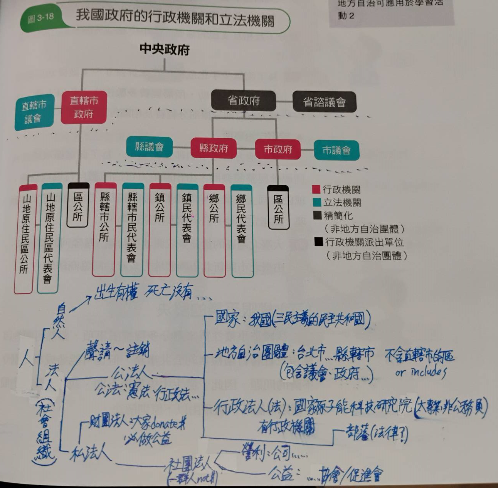

# L3 政府的組成與運作

#### `def`: 
> 內閣: 類似行政院  
> 閣揆(首相 or 總理): 類似行政院長
> 副署: 因為簽署的人無實權，需要別人簽名來授權

## 內閣制
#### 以英國為例

- 國會: 
  - 由人民選出(對人民負責)，過半數黨組閣
  - 若過半數黨則須組**聯合內閣**(仍需過半)
  - 聯合內閣通常不會第一第二大黨組(通常是敵人)
  - 可以質詢內閣、立法、審查預算案...
  - \#註: \[上議院: 對民眾&gov, 下議院: 對內閣\]

- 虛位元首: 
    - 倒閣時被動解散立法院、公布法律(需**副署**)

- 內閣: 
  - 由國會選出(須對國會負責)
  - 閣揆由虛位元首任命，通常是最大黨黨魁
  - 可以**提出**預算案、法案、施政報告、替虛位元首副署...

優點: 行政效率佳、可以倒閣  
缺點: 國會專斷、聯合內閣不穩定、球員兼裁判

## 總統制
#### 以美國為例

- 總統:
  - 民選(選舉人團間接選舉)
  - 可提國情咨文(施政方針)
  - 擁有**法案覆議權**(否決權)
  - 覆議的法案須參眾兩院皆須 $\frac{2}{3}$ 同意才可強迫執行(幾乎不可能)

- 行政院:
  - 國務卿 -> 下面有各部會首長
  - 國務卿人選須經**參議院同意**
  - 行政院須**對總統負責**

- 國會: 
  - 分為**參眾兩院**
  - 含部分監察權(可以彈劾)
  - 可以審查預算、同意人事

優點: 球員不兼任裁判、立法&行政(任期固定、各自為政、皆為民選)  
缺點: 不能罷免、不能倒閣、法案否決 -> 政治僵局

## 混合制
#### 以我國為例

行政權: 
  - 總統  
    - 民選(直接)  
    - 主導國防&外交
    - 可以統帥三軍、特赦、主持國安會議
    - 若非自己的權限則需副署
    - 偏向"有權無責"
  - 行政院長
    - 總統直接任命
    - 向立法院負責
    - 主導內政、經濟...
    - 可以副署相關法律&命令
    - 偏向"有責無權"
  - 行政院
    - 各部會首長由行政院長提名，總統任命
    - 可以副署相關法律&命令
  
立法權: 
  - 管根法案、預算案...相關的

優點: 民選、沒有另外兩者的缺點
缺點: 雙首長權責不清、倒閣完行政院長仍是總統任命

## 中央&地方權限劃分
|      | 單一制 | 聯邦制 |
| :--: | :--:  |  :--:  |
| 概括權力 | 中央 | 地方 |
| 列舉權力 | 地方 | 中央 |
| 代表 | 法日英韓 | 美德巴印 |
| 優點 | 全國一致 | 反映地方 |
| 缺點 | 難顧地方 | 區域落差 | 

## 我國的地方政府

